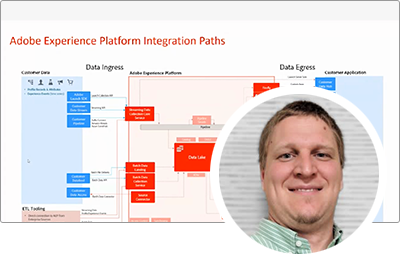
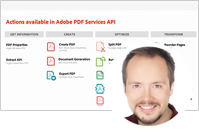

# アドビ開発者ライブ {#overview}

アドビ開発者向けライブは、多様な背景と単一の目的を持つアドビ開発者とエクスペリエンスビルダーを結集し、素晴らしいエンドツーエンドのエクスペリエンスを作り出します。この 2 日間の会議では、開発者向けの重要な更新、技術セッション、コミュニティネットワークの機会を紹介します。

Adobe Experience Cloud、Document Cloud、Creative Cloudの各Adobe製品チームは、デザイン、コンテンツ作成ワークフロー、ドキュメントサービス、顧客体験管理を業界全体で実現する、最新の技術進歩と開発者ツールを紹介します。

今後のイベントに登録 **[ここ](https://developerevents.adobe.com/)**.

>[!TIP]
>
>**記録されたすべてのセッションは、左側のナビゲーションに表示されます**.

## 2021年10月

Adobe Experience Cloud、Document Cloud、Creative Cloudの各Adobe製品チームは、設計、コンテンツ作成ワークフロー、ドキュメントサービス、顧客体験管理を業界全体で実現する最新の技術進歩と開発者ツールを紹介しました。

他のすべてを確認する [セッション](2021/october/overview.md) !

<table>
  <tr>
   <td>
      
      

         <a href="2021/october/headless.md"><strong>ヘッドレスサイト</strong></a>         
          <em>AEM Sites、主要プロダクトマネージャ、Mathias Siekl と</em>
      

      

         
         GraphQL for AEM 6.5 およびAdobe Experience Manager as a Cloud Serviceで利用可能なコンテンツフラグメントを使用して、Adobe Experience Managerをヘッドレス CMS として使用する方法を見てみましょう。
      

     </td>   
     <td>
      
      

         <a href="2021/october/aep-integration.md"><strong>Adobe Experience Platform統合の概要</strong></a>
          <em>エンタープライズソリューションアーキテクト担当の Eric Knee 氏</em>
      

      

         
         このセッションでは、Adobe Experience Platformがエコシステム内に統合できる様々な方法と、統合作業の計画時に考慮すべき事項の概要を説明します。
      

   </td>
   </td>
     <td>
      
      

         <a href="2021/october/pdf-services-api.md"><strong>Adobe Sign API を使用したドキュメントの生成とアプリ内での電子署名の取得</strong></a>
          <em>ベン・バンダーバーグと共に、主要開発者エバンジェリスト</em>
      

      

         
         Adobeドキュメント生成 API は、Microsoft Word テンプレートをデータと結合して駆動する、強力なドキュメント作成サービスです。 Adobe Sign API と組み合わせると、開発者は署名ワークフローで処理できる動的ドキュメントを簡単に生成できます。
      

   </td> 
  </tr>
</table>

## 2021年2月

この 2 日間の会議では、ヘッドレスやGraphQL、Adobe Experience Manager as a Cloud Service、テクニカルセッション、コミュニティネットワークの機会など、Adobe Experience Managerの開発者向けの重要なアップデートが紹介されました。

他のすべてを確認する [セッション](2021/february/overview.md).

<table>
  <tr>
   <td>
      
      

         <a href="2021/february/headless-graphql-content-fragments.md"><strong>ヘッドレス — GraphQLとコンテンツフラグメント</strong></a>         
          <em>ソフトウェアエンジニア Jabran Asghar 氏と</em>
      

      

         
         最新のコンテンツフラグメントの機能強化を利用した新しいヘッドレス機能について説明します。 このセッションでは、AEM Cloud ServiceのGraphQL API に焦点を当てます。
      

     </td>   
     <td>
      
      

         <a href="2021/february/rapid-frontend-devlopment.md"><strong>フロントエンド開発 — サイトのフロントエンドを迅速に構築しデプロイするための将来のワークフロー。</strong></a>
          <em>と、シニアプロダクトマネージャの Gabriel Walt</em>
      

      

         
         サイトテンプレートを使用して、数回のクリックで新しいサイトを作成し、CSS&amp;JS などのフロントエンドアセットを迅速にデプロイすることで、フロントエンド開発の楽しみを取り戻します。
      

   </td>
   </td>
     <td>
      
      

         <a href="2021/february/get-ready-aem-cloud.md"><strong>Cloud Serviceの準備 — 移行のベストプラクティス</strong></a>
          <em>Andreea Moise 氏（シニア・ソフトウェア・エンジニア）</em>
      

      

         
         コードベースを適応させて、内部で処理される将来のアップグレードに対してクラウドフレンドリーで防弾性の高いものにすることが、AEM Cloud Serviceのメリットを最大限に活かすための鍵となります。
      

   </td>
  </tr>
</table>