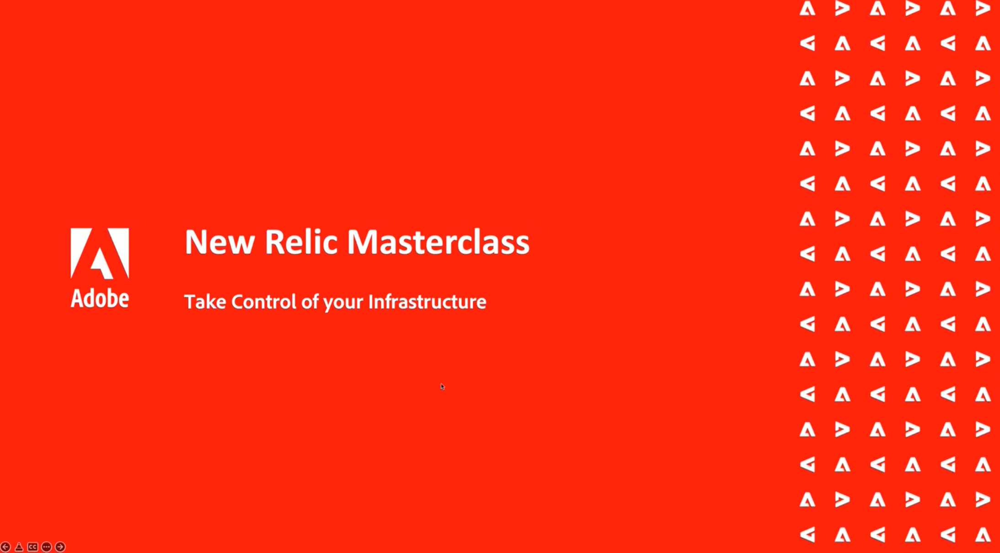

# APAC Commerce ウェビナーシリーズ

APAC Commerce ウェビナーシリーズは、Adobe Commerceのお客様向けの月次ワークショップで、ベストプラクティスから製品ロードマップ、業界の動向に至るまで幅広いトピックを取り上げています。 ビジネス全体の様々な製品エキスパートから連絡を受け、ライブに参加して、質問を投げかけ、チームと直接関わる機会を得ます。 このシリーズは、Adobe Commerceプラットフォームへの投資を最大限に活かし、成功に導くのに役立ちます。

## 最新情報

<table>
<tr>
  <td>
    
     

      <a href="https://experienceleague.adobe.com/docs/events/apac-commerce-recordings/2023/adobes-paas-cloud-commerce.html">
        <strong>Adobeの PaaS Cloud Commerce でビジネスを合理化</strong>
      </a>
    

    

    <em>PaaS の自己ホスト型や既存のお客様が設定の最適化を希望している場合でも、AdobeのCommerce CloudPaaS ソリューションのメリットを見つけるために、ウェビナーに参加してください。</em>
    

  </td>
  <td>
    
     

      <a href="https://experienceleague.adobe.com/docs/events/apac-commerce-recordings/2023/ai-personalisation.html">
        <strong>AI を利用したパーソナライゼーション</strong>
      </a>
    

    

    <em>AI の機能を活用して、Adobeの AI への投資とコマースへの統合により、優れた顧客体験を実現します。</em>
    

  </td>
  <td>
    
     

      <a href="https://experienceleague.adobe.com/docs/events/apac-commerce-recordings/2022/new-relic.html">
        <strong>New Relic Masterclass</strong>
      </a>
    

    

    <em>このウェビナーに参加して、New Relicでのインフラストラクチャの制御方法を学んでください。 インフラストラクチャデータにアクセスし、把握することで、絶対に自信を持って次のキャンペーンにアプローチします。</em>
    

  </td>  
</tr>
</table>

>[!TIP]
>
>**記録されたすべてのセッションは、左側のナビゲーションに表示されます**.
