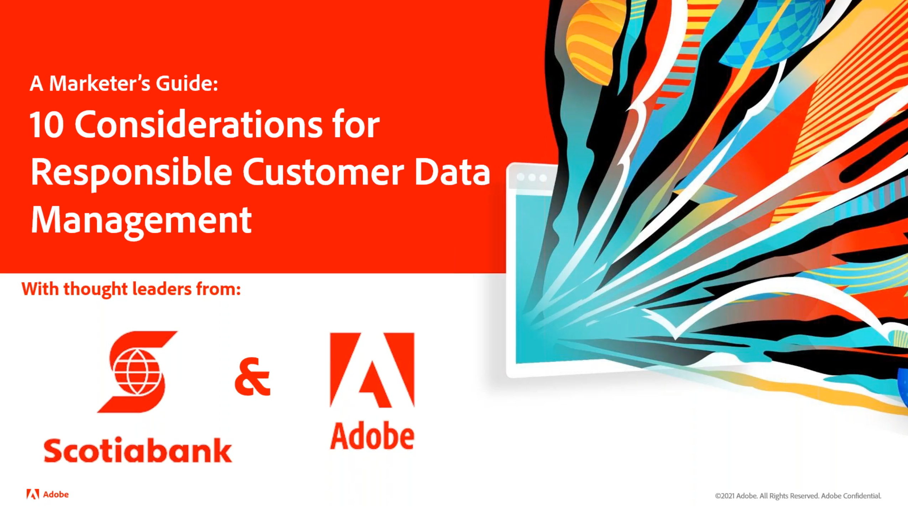

# 顧客データ管理 - 担当者の声 {#overview}

Customer Data Management Voices へようこそ。顧客データ管理の技術およびマーケティングプラクティスのリーダーやスペシャリストとして、お客様の宛先をご紹介します。 このページでは、同僚から話を聞き、インスピレーションを得て、martech の開発について学ぶことができます。 登録は必要ありません。クリックして視聴するだけです。

>[!TIP]
>
>**記録されたすべてのセッションは、左側のナビゲーションに一覧表示されます**。

## 顧客データ管理の構成要素

<table>
  <tr>
   <td>
      
      

         <a href="./cdm/first-mile.md"><strong> データ管理の最初の 1 マイルを合理化 </strong></a>
          
      

   </td>
   <td>
      
      

         <a href="./cdm/cdp-success.md"><strong> 成功に向けた顧客データプラットフォームの選択 </strong></a>
          
      

    </td>
    <td>
      
      

         <a href="./cdm/people-and-process.md"><strong>CDP のベストプラクティス – 人物とプロセス </strong></a>
          
      

    </td>
   </tr>
   <tr> 
   <td>
      
      

         <a href="./cdm/evolving-your-audience-center-of-excellence.md"><strong> オーディエンスのセンターオブエクセレンスの進化 </strong></a>
          
      

    </td>
   <td>
      
      

         <a href="./cdm/building-better-experiences-with-customer-profiles.md"><strong> 顧客プロファイルを使用した、より優れたエクスペリエンスの構築 </strong></a>
      

      

         
    </td>
   <td>
      
      

         <a href="./cdm/how-marketing-teams-are-improving-data-management-strategies.md"><strong> マーケティングチームによるデータ管理戦略の改善方法 </strong></a>
      

      

      

    </td>
  </tr>
</table>

## オーディエンスとプロファイルのデータガバナンスとプライバシー

<table>
  <tr>
   <td>
      
      

         <a href="./governance/healthcare-shield.md"><strong>Adobe Real-time Customer Data Platformと Healthcare Shield</strong></a>
          
      

      

         
   </td> 
   <td>
      
      

         <a href="https://experienceleague.adobe.com/docs/platform-learn/tutorials/privacy/ten-considerations-for-responsible-customer-data-management.html?lang=ja"><strong> 顧客データ管理の責任に関する 10 の考慮事項 </strong></a>
          
      

      

         
    </td>
    <td>
      
      

         <a href="https://experienceleague.adobe.com/docs/platform-learn/tutorials/privacy/elevating-the-marketers-role-as-a-data-steward.html?lang=ja"><strong> データ管理人としてのマーケターの役割の向上 </strong></a>
          
      

      

         
       

    </td>
  </tr>
</table>

## 業界の議論

<table>
  <tr>
     <td>
      
      

         <a href="./industry/build-superb-experiences-with-your-first-party-data.md"><strong> ファーストパーティデータで優れたエクスペリエンスを構築 </strong></a>
      

      

      

    </td>
     <td>
      
      

         <a href="./industry/data-collaboration-in-the-first-party-data-context.md"><strong> ファーストパーティデータコンテキストでのデータCollaboration</strong></a>
      

      

      

    </td>
     <td>
      
      

         <a href="./industry/the-future-of-data-management-and-the-changing-environment.md"><strong>データ管理の将来と変化する環境</strong></a>
      

      

      

    </td>
   <td>
      
      

         <a href="./industry/brands-vs-consumers.md"><strong> ブランドと消費者の 2 つの認識の物語 </strong></a>
          
      

    </td>
  </tr>
</table>
