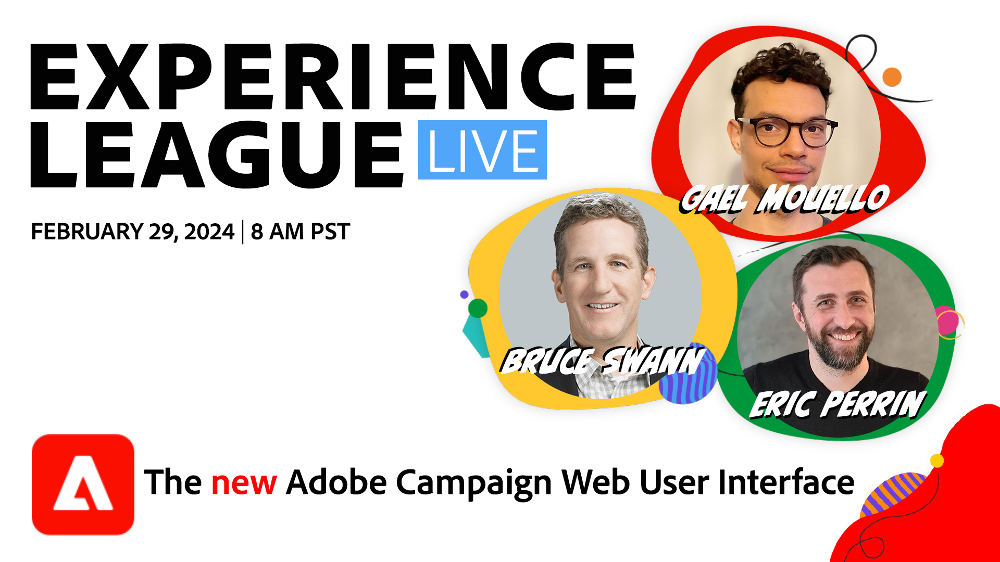

# 新しいAdobe Campaign Web ユーザーインターフェイスを先に進める

Adobe Campaign v8 は、まったく新しい外観と操作性を備えています。 新しいユーザーエクスペリエンスにより、キャンペーンの設計プロセスが簡素化され、他のAdobe Experience Cloudソリューションとの整合性が保たれます。

このExperience Leagueライブセッションに参加します。Adobe Campaignの製品エキスパートは、新しいユーザーエクスペリエンスでクロスチャネルキャンペーンの計画、開始、測定の方法を紹介します。

**上の画像をクリックして、イベントに登録します。**
