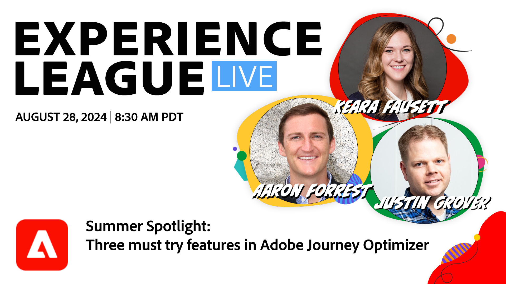

# Summer Spotlight - Adobe Journey Optimizerの機能を試してみる

ジャーニーの実験、フリークエンシーキャップ、多言語メッセージという 3 つの機能をAdobe Journey Optimizerに導入して、この夏はカスタマーエンゲージメントを強化しましょう。

**[YouTubeでの表示に関するリマインダーの設定 ](https://www.youtube.com/live/u_UEsl2Nw3M){target="_blank"}**

**詳細を表示**:
夏が暑くなるにつれて、新しい効果的な方法で顧客と関わる機会も増えていきます。 Journey Optimizerの実践者向けの 1 時間のExperience Leagueライブにご参加ください。マーケティングオペレーション、キャンペーン/ジャーニー管理、カスタマーエクスペリエンスなど、あらゆる分野の実践者が対象で、Adobe Journey Optimizerの強力な機能を詳しく説明します。

ジャーニーの実験が、ジャーニー全体で最適な結果を得るために顧客とのインタラクションを微調整するのにどのように役立つかをご確認ください。 フリークエンシーキャップを実装して、過剰通信を避け、メッセージが確実にマークされるようにする方法を説明します。 多言語メッセージの利点を調べ、好みの言語内の様々なオーディエンスとつながります。

この夏のイベントは、オムニチャネルマーケティング戦略を強化し、シーズンのエンゲージメントの機会を最大限に活用します。 カスタマージャーニーとキャンペーンを高めてAdobe Journey Optimizerでの成功を推進するこのチャンスをお見逃しなく。
