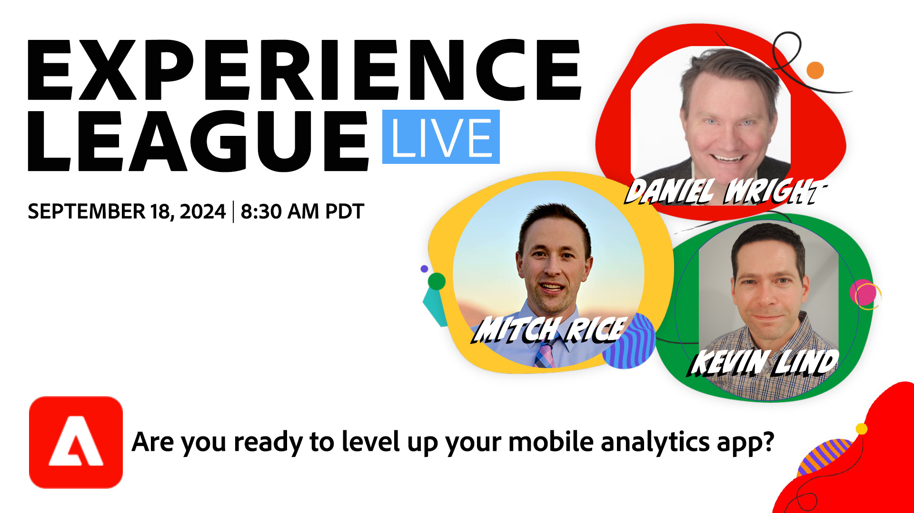

# モバイル分析アプリをレベルアップする準備はできていますか？

このセッションでは、Edge Bridge拡張機能を使用して、移行に伴うギャップを埋める方法を説明します。 Edge Bridgeを使用するために、モバイルプロパティを設定し、クライアントサイド実装を更新する手順を説明します。

**[YouTubeでの表示に関するリマインダーの設定 ](https://www.youtube.com/live/QKz1slMT36Y){target="_blank"}**

**詳細を表示**:
モバイルアプリでAdobe Analyticsを使用して、デジタルビジネスに関するインサイトを得て、顧客がアプリをどのように使用しているかを理解してきました。

また、Edge Data Collection は、Real-Time CDP、Journey Optimizer、Customer Journey Analyticsなどの他のソリューションを活用できる、Adobeエコシステムの未来であるということも聞きました。

Analytics の既存の実装を維持し、自分のペースでAdobe Experience Platform（AEP）に移行するようにアプリをアップグレードすることは可能ですか？

このセッションでは、Edge Bridge拡張機能を使用して、移行に伴うギャップを埋める方法を説明します。 Edge Bridgeを使用するために、モバイルプロパティを設定し、クライアントサイド実装を更新する手順を説明します。

移行後も、Analytics でデータにアクセスして、AEP に一歩近づくことができます。 まだ分からない？ 実装の検証とデバッグをリアルタイムで行う方法を説明します。
