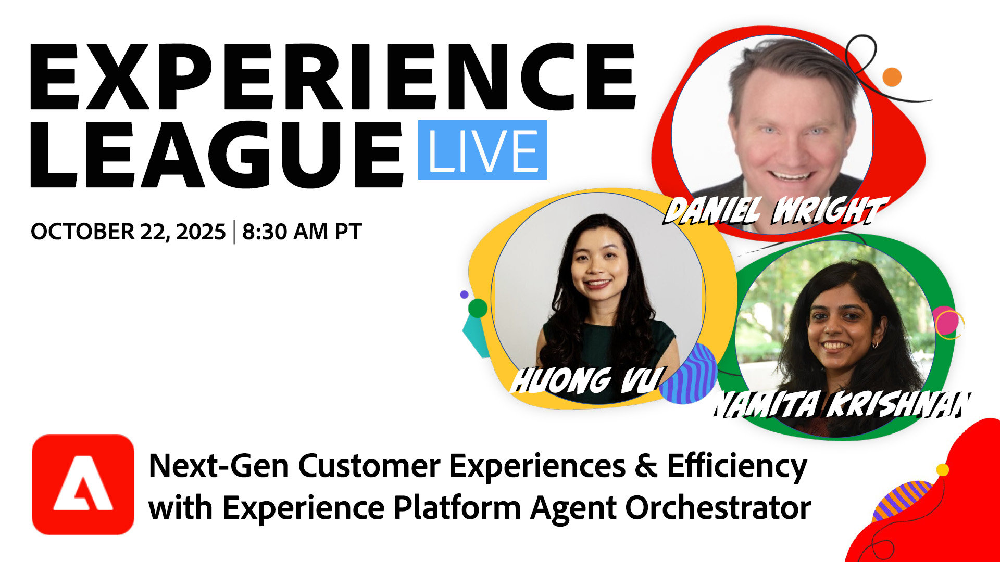

# Adobe Experience Platform Agent Orchestratorによる次世代の顧客体験と効率性

Adobe Experience Platform Agent OrchestratorはAdobe Experience Platformの新しいアジェンティック層です。 Experience Platform Agent Orchestratorは、プラットフォームの豊富なデータとカスタマーナレッジを活用するように設計されており、専用のエキスパート Adobe Experience Platform Agents の背後にあるインテリジェンスと推論を強化し、複雑な意思決定や問題解決のタスクを迅速かつ大規模に、すべて人間の監督で実行できるようにします。 AI アシスタントなどの対話型インターフェイスを通じて、ユーザーはこれらのエージェントや他の AI コンポーネントにアクセスし、生産性と効率の向上を促進することができます。

> 

[ 番組のリマインダーを設定！](https://youtube.com/live/WS_DzRmYNzw)
