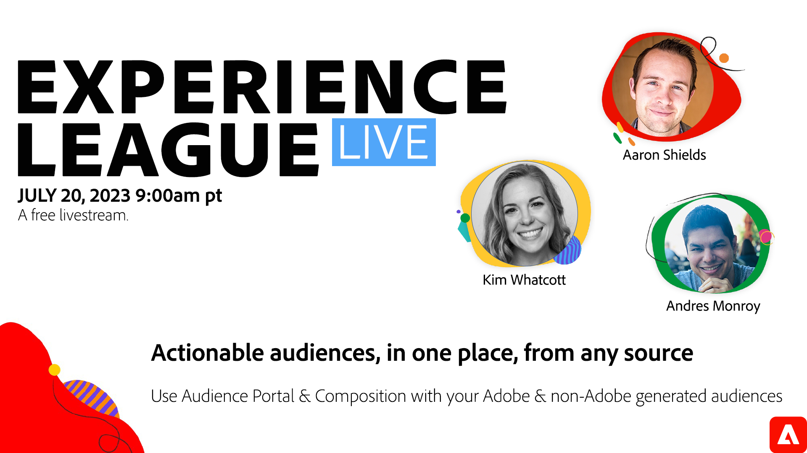

# 標準的なコントロールを使用し&#x200B;て、あらゆるソースから 1 か所でアクションにつながるオーディエンスを利用

新しい Audience Portal および構成機能では、Real-Time CDPのセグメント化とオーディエンス管理をまったく新しいレベルに導きました。 事前定義済みオーディエンス、一元化されたオーディエンス管理、新しい構成キャンバスの取り込みにより、マーケティングチャネルをまたいで主要なオーディエンスを構築、整理、配布できます。

上の画像をクリックして、イベントに登録します。 またね！
