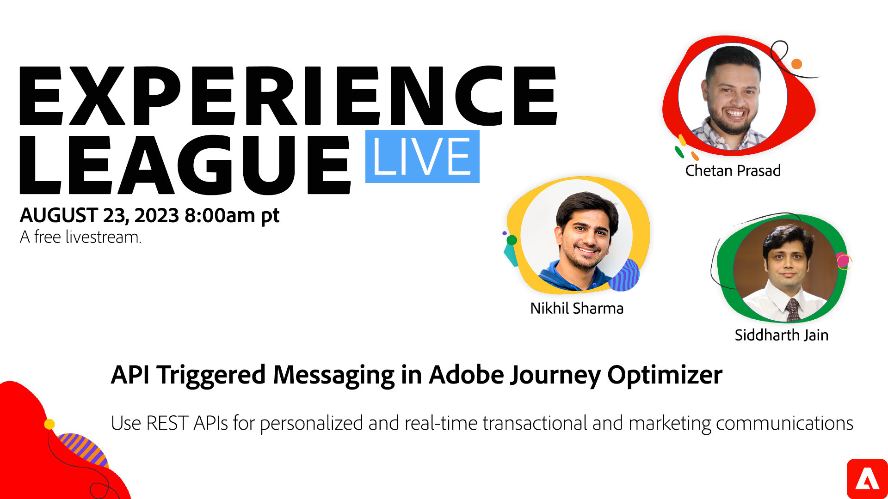

# Adobe Journey Optimizerで API トリガーメッセージ

コンテキストに応じてパーソナライズされたリアルタイムのトランザクションおよびマーケティングコミュニケーションで REST API を使用する方法を説明します。

Adobe Journey Optimizerは、パーソナライズされたリアルタイムの 1:1 カスタマージャーニーを作成および管理する最新の、マーケターに適したインターフェイスとワークフローを備えていますが、ジャーニーを作成せずに、緊急のシグナルと作成者メッセージに基づいて、時間依存性の高いメッセージをオーディエンスに伝える必要があります。 これらのメッセージには、パスワードのリセット、1 回限りのコード、スポーツファンの購読者ベースに対するゲーム後の更新などが含まれます。

API トリガーキャンペーンを使用すると、企業はキャンペーンを設定し、それを複数回使用して、REST API 経由でトリガーすることで、リアルタイムのコンテキスト情報を使用してパーソナライズされたメッセージを配信できます。

このExperience Leagueライブセッションでは、Adobe製品の専門家が、AJO で API トリガーメッセージング機能を使用してトランザクションおよびマーケティングの使用例を実行する方法を説明します。

**上の画像をクリックして、番組のリマインダーを設定します。**
