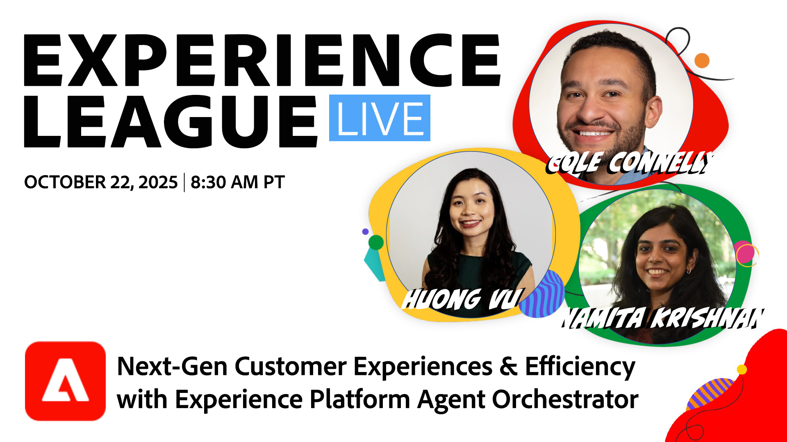

# Experience League LIVE

Experience LeagueLIVE は、Experience Leagueチームが制作したライブストリーミング番組です。  アドビ製品のエキスパートとつながり、Adobe Experience Cloud アプリケーションで適用できる実用的なヒント、テクニック、戦略を学ぶ機会です。

## 今後のExperience League LIVE イベント

<table>
    <tr>
        <td style="vertical-align: top;">
            

              <a href="episodes/exl-live-episode-10-16-25.md">
                <strong>Customer Journey Analytics B2B editionの力を解き放つ </strong>
              </a>
               <em>Doug Moore 氏、Kari Olson 氏、Caitlin Baunach 氏 </em>
               <em>2025 年 10 月 16 日 </em>
            

        </td>
        <td style="vertical-align: top;">
            

              <a href="episodes/exl-live-episode-10-22-25.md">
                <strong>Adobe Experience Platform Agent Orchestratorによる次世代の顧客体験と効率性 </strong>
              </a>
               <em> ダニエル・ライト、ナミタ・クリシュナン、フォン・ブー、コール・コネリー </em>
               <em>2025 年 10 月 22 日 </em>
            

        </td>
         <td style="vertical-align: top;">
            

              <a href="episodes/exl-live-episode-10-30-25.md">
                <strong> 実験の次の時代：Agentic AI がどのようにして、よりスマートなテストと成長を促進しているか </strong>
              </a>
               <em>Sandra Hausmann、Brent Kostak、Justin Grover、David Arbor 付き </em>
               <em>2025 年 10 月 30 日 </em>
            

        </td>
    </tr>

</table>

## スタッフのおすすめ

<table style="max-width: 1214px;">

<tr>
  <td style="vertical-align: top;">
    

      <a href="episodes/exl-live-episode-06-26-24.md">
        <strong> 最新のAdobe Real-Time CDP リリースによって、ビジネスにどう影響するか </strong>
      </a>
       <em> ニーナ・カルーソ、ルディ・シュンパート、ダグ・ムーア </em>
       <em>2024 年 6 月 26 日 </em>
    

  </td>

<td style="vertical-align: top;">
    
    

      <a href="episodes/exl-live-episode-05-16-24.md"><strong> これが、Analytics を Web SDKに移行する方法です </strong></a>
       <em> ミッチ・ライス、ジョー・コーリー、ダグ・ムーア </em>
       <em>2024 年 5 月 16 日 </em>
    

  </td>

<td style="vertical-align: top;">
    
    

      <a href="episodes/exl-live-episode-04-24-24.md">
        <strong>Journey Optimizerの新しいコードベースのエクスペリエンスチャネル </strong>
      </a>
       <em>Sandra Hausmann、Robert Calangiu、Brent Kostak のコメント </em>
       <em>2024 年 4 月 24 日 </em>
    

  </td>
  </tr>

</table>

>[!TIP]
>
>その他の学習方法については、無料の [ コース ](https://experienceleague.adobe.com/?lang=ja#dashboard/learning) および個別の [ チュートリアル ](https://experienceleague.adobe.com/docs/home-tutorials.html?lang=ja) をご覧ください。

