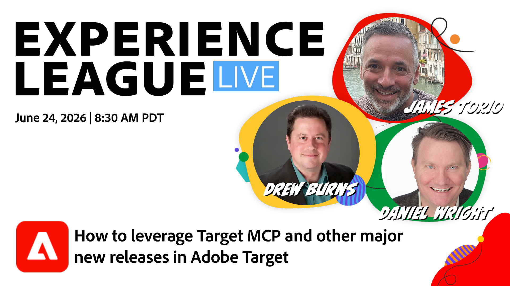

# Experience League LIVE

Experience League ライブ番組は、Experience League チームが制作したライブストリーミング番組です。  アドビ製品のエキスパートとつながり、Adobe Experience Cloud アプリケーションで適用できる実用的なヒント、テクニック、戦略を学ぶ機会です。

## 今後のExperience League ライブイベント

<table>
<tr>
    <td style="vertical-align: top;">
    

      <a href="episodes/exl-live-episode-06-17-26.md">
        <strong>本番稼働前に、ジャーニーを効率的にテスト、シミュレート、検証する方法</strong>
      </a>
       <em>Sandra Hausmann、Ariel Sultan、Nicolas Dufauと共に</em>
       <em>2026年6月17日</em>
    

  </td>
</tr>
<tr>
    <td style="vertical-align: top;">
    

      <a href="episodes/exl-live-episode-06-24-26.md">
        <strong>Adobe TargetでTarget MCPおよびその他の主要な新リリースを活用する方法</strong>
      </a>
       <em> ダニエル・ライト、ジェームズ・トリオ、ドリュー・バーンズと共に</em>
       <em>2026年6月24日</em>
    

  </td>
</tr>
</table>

## スタッフのおすすめ

<table style="max-width: 1214px;">

<tr>
  <td style="vertical-align: top;">
    

      <a href="episodes/exl-live-episode-06-26-24.md">
        <strong>最新のAdobe Real-Time CDP リリースでビジネスの可能性を広げる方法</strong>
      </a>
       <em>Nina Caruso、Rudi Shumpert、Doug Mooreと共に</em>
       <em>2024年6月26日</em>
    

  </td>

<td style="vertical-align: top;">
    
    

      <a href="episodes/exl-live-episode-04-24-24.md">
        <strong>Journey Optimizerの新しいコードベースのエクスペリエンスチャネル </strong>
      </a>
       <em>Sandra Hausmann、Robert Calangiu、Brent Kostakと共に</em>
       <em>2024年4月24日</em>
    

  </td>
  </tr>

</table>

>[!TIP]
>
>その他の学習方法については、無料の[&#x200B; コース &#x200B;](https://experienceleague.adobe.com/?lang=ja#dashboard/learning)と個別の[&#x200B; チュートリアル &#x200B;](https://experienceleague.adobe.com/docs/home-tutorials.html?lang=ja)をご覧ください。

