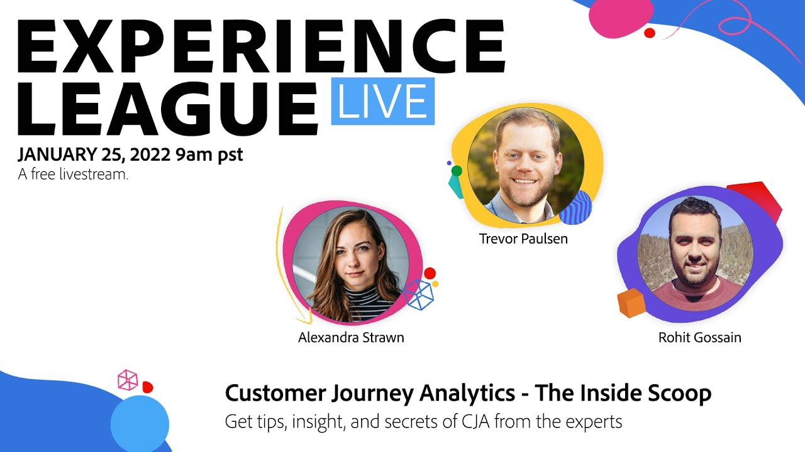

# Experience League LIVE

Experience League LIVE は、Experience League チームが制作したライブストリーミングショーです。 アドビ製品の専門家とつながり、Adobe Experience Cloud アプリケーションで適用できる実用的なヒント、テクニック、戦略を学ぶ機会です。

## 今後のExperience Leagueライブイベント

<table>
<tr>

<td style="vertical-align: top;"><b>2024 年 6 月の番組について詳しくは、すぐにこのページをご覧ください。</b> 
    * Adobe Real-time Customer Data Platformの H1 2024 リリース 
    * Adobe Workfrontのレビューと承認の統合
  </td>
</tr>
</table>

## スタッフのおすすめ

<table style="max-width: 1214px;">

<tr>
  <td style="vertical-align: top;">
    

      <a href="/help/experience-league-live/episodes/exl-live-episode-04-21-22.md">
        <strong>ヘッドフルからヘッドレスへのAEM</strong>
      </a>
       <em>ダニー・ゴードン、アモール・アナンド、サチン・マリ、ショーン・シュタイマーと共に</em>
       <em>2022 年 4 月 21 日（Pt）</em>
    

  </td>

<td style="vertical-align: top;">
    
    

      <a href="episodes/exl-live-episode-08.md"><strong>Customer Journey Analytics – 内側のスクープ</strong></a>
       <em>trevor Paulsen 氏、Rohit Gossain 氏、Alex Strawn 氏</em>
       <em>2021 年 1 月 25 日（Pt）</em>
    

  </td>

<td style="vertical-align: top;">
    
    

      <a href="episodes/exl-live-episode-05-26-22.md">
        <strong>エキスパートに質問する：Web SDK の基本</strong>
      </a>
       <em>Rudi Shumpert、Jeff Chasin、Eric Matisoff との共同作業</em>
       <em>2022 年 5 月 26 日（Pt）</em>
    

  </td>
  </tr>

</table>

>[!TIP]
>
>その他の学習方法については、無料の [コース](https://experienceleague.adobe.com/?lang=ja#dashboard/learning) と、個別の [チュートリアル](https://experienceleague.adobe.com/docs/home-tutorials.html?lang=ja) をご覧ください。
