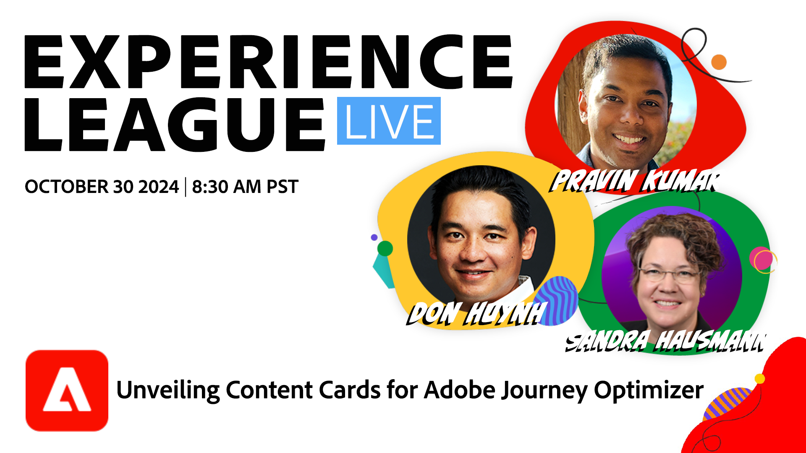

# Experience League LIVE

Experience Leagueライブは、Experience Leagueチームが制作したライブストリーミング番組です。  Adobe製品のエキスパートとつながり、Adobe Experience Cloud アプリケーションで活用できる実用的なヒント、テクニック、戦略を学ぶ機会です。

## 今後のExperience Leagueライブイベント

<table>
<tr>

<td style="vertical-align: top;">
    

      <a href="episodes/exl-live-episode-40-2024-10-24.md"><strong> モバイルアプリケーションや web アプリケーション全体でユーザーエンゲージメントを強化し、会話を強化するために設計された、Adobe Journey Optimizerの新しい多目的メッセージングチャネルであるコンテンツカードについて説明します。 </strong></a>
       <em>Don Huyhn と Pravin Kumar は </em>
       <em>2024 年 10 月 30 日 PT8 時 30 分 </em>
        <a href="https://engage.adobe.com/ExpLeagueLive-241030.html?s_rtid=7015Y0000048hxzQAA&amp;s_iid=&amp;sfid=&amp;acctid=&amp;ecp="> このイベントに登録 </a>
    

  </td>
</tr>
</table>

## スタッフのおすすめ

<table style="max-width: 1214px;">

<tr>
  <td style="vertical-align: top;">
    

      <a href="episodes/exl-live-episode-06-26-24.md">
        <strong> 最新のAdobe Real-Time CDP リリースによって、ビジネスにどう影響するか </strong>
      </a>
       <em> ニーナ・カルーソ、ルディ・シュンパート、ダグ・ムーア </em>
       <em>2024 年 6 月 26 日 </em>
    

  </td>

<td style="vertical-align: top;">
    
    

      <a href="episodes/exl-live-episode-05-16-24.md"><strong> これが、Analytics を Web SDK に移行する方法です </strong></a>
       <em> ミッチ・ライス、ジョー・コーリー、ダグ・ムーア </em>
       <em>2024 年 5 月 16 日 </em>
    

  </td>

<td style="vertical-align: top;">
    
    

      <a href="episodes/exl-live-episode-04-24-24.md">
        <strong>Journey Optimizerの新しいコードベースのエクスペリエンスチャネル </strong>
      </a>
       <em>Sandra Hausmann、Robert Calangiu、Brent Kostak のコメント </em>
       <em>2024 年 4 月 24 日 </em>
    

  </td>
  </tr>

</table>

>[!TIP]
>
>その他の学習方法については、無料の [ コース ](https://experienceleague.adobe.com/?lang=ja#dashboard/learning) および個別の [ チュートリアル ](https://experienceleague.adobe.com/docs/home-tutorials.html?lang=ja) をご覧ください。
