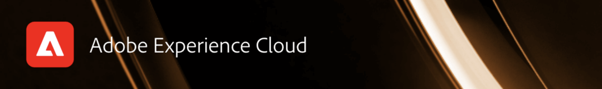

# Adobe Experience Manager Gems

**AEM GEMs**&#x200B;へようこそ – Adobe Experience Manager AEMのエキスパートが提供するテクニカルな製品の詳細に焦点を当てたAdobe ウェビナーシリーズです。 このシリーズは、AEMに関する製品ドキュメントと他のすべての技術チャネルを補完するもので、開発者がAdobe Experience Managerに関するさまざまなトピックについて詳しく説明することができます。

ウェビナーは定期的に開催されます。  重要なヒント，

* AEM GEMはすべて無料です
* 登録が必要です
* セッションを見逃した場合は、ここに戻って録画を確認してください
* AEM GEMは通常1時間で、15分のQ&amp;Aがあります

## 2025

<!-- 
CARDS

* gems2025/mastering-cache-efficiency-for-optimal-page-performance.md
* gems2025/maximize-impact-with-sites-optimizer.md
* gems2025/getting-started-adobe-managed-cdn.md

-->
<!-- START CARDS HTML - DO NOT MODIFY BY HAND -->

    

        

            

                <figure class="image x-is-16by9">
                    
                </figure>
            

            

                

                    

                        <a href="gems2025/maximize-impact-with-sites-optimizer.md" target="_blank" rel="referrer" title="AEM GEM - AEM Sites Optimizerでweb エクスペリエンスの効果を最大化">AEM GEM - AEM Sites Optimizerでweb エクスペリエンスの効果を最大化</a>
                    

                    
Sites OptimizerでAIを利用して、マーケティング部門と開発部門にリアルタイムのインサイトとレコメンデーションを提供し、サイトのパフォーマンス、SEO、ユーザーエンゲージメントを向上させる方法をご確認ください。

                

                <a href="gems2025/maximize-impact-with-sites-optimizer.md" target="_blank" rel="referrer" class="spectrum-Button spectrum-Button--outline spectrum-Button--primary spectrum-Button--sizeM" style="align-self: flex-start; margin-top: 1rem;">
                    詳細情報
                </a>
            

        

    

    

        

            

                <figure class="image x-is-16by9">
                    
                </figure>
            

            

                

                    

                        <a href="gems2025/getting-started-adobe-managed-cdn.md" target="_blank" rel="referrer" title="AEM GEM - Adobe Managed CDNの概要">AEM GEM - Adobe Managed CDNの概要</a>
                    

                    
AEM Cloud ServiceでAdobe Managed CDNを設定し、新しいCDN設定機能でパフォーマンスとセキュリティを強化する方法について説明します。

                

                <a href="gems2025/getting-started-adobe-managed-cdn.md" target="_blank" rel="referrer" class="spectrum-Button spectrum-Button--outline spectrum-Button--primary spectrum-Button--sizeM" style="align-self: flex-start; margin-top: 1rem;">
                    詳細情報
                </a>
            

        

    

<!-- END CARDS HTML - DO NOT MODIFY BY HAND -->

## 2024年

<!-- 
CARDS
* gems2024/aem-authoring-and-edge-delivery.md
* gems2024/content-management-apis.md
* gems2024/edge-delivery-for-aem-assets.md
* gems2024/edge-delivery-for-aem-forms.md
* gems2024/improving-dev-experience-for-aem-assets-with-new-apis-and-events.md
* gems2024/private-github-for-aem-cloud-manager.md
* gems2024/rapid-development-environment-news.md
* gems2024/storefronts-on-edge-delivery-with-adobe-commerce.md
-->
<!-- START CARDS HTML - DO NOT MODIFY BY HAND -->

    

        

            

                <figure class="image x-is-16by9">
                    
                </figure>
            

            

                

                    

                        <a href="gems2024/aem-authoring-and-edge-delivery.md" target="_blank" rel="referrer" title="AEM オーサリングとEdge Delivery Servicesの基本を学ぶ">AEM オーサリングとEdge Delivery Servicesの概要</a>
                    

                    
AEM GEM ウェビナーでは、AEM オーサリングとEdge Delivery Servicesの連携、AEM Cloud Serviceを使用したプロジェクトの作成、WYSIWYG オーサリングインターフェイスのメンテナンスについて説明します。

                

                <a href="gems2024/aem-authoring-and-edge-delivery.md" target="_blank" rel="referrer" class="spectrum-Button spectrum-Button--outline spectrum-Button--primary spectrum-Button--sizeM" style="align-self: flex-start; margin-top: 1rem;">
                    詳細情報
                </a>
            

        

    

    

        

            

                <figure class="image x-is-16by9">
                    
                </figure>
            

            

                

                    

                        <a href="gems2024/content-management-apis.md" target="_blank" rel="referrer" title="AEM GEM - AEM Sitesのパワーを引き出す – Content Management APIのマスター">AEM GEM - AEM Sitesの機能を引き出す – Content Management APIをマスター</a>
                    

                    
AEM GEMのセッションでは、AEM SitesのAPI ファーストのパターンについて解説します。高度なOpenAPI標準、イベントおよびwebhook、翻訳オートメーション用の新しいREST APIなど、Adobeの専門家が提供するインサイトを利用できます。

                

                <a href="gems2024/content-management-apis.md" target="_blank" rel="referrer" class="spectrum-Button spectrum-Button--outline spectrum-Button--primary spectrum-Button--sizeM" style="align-self: flex-start; margin-top: 1rem;">
                    詳細情報
                </a>
            

        

    

    

        

            

                <figure class="image x-is-16by9">
                    
                </figure>
            

            

                

                    

                        <a href="gems2024/edge-delivery-for-aem-assets.md" target="_blank" rel="referrer" title="AEM AssetsとEdge Delivery Servicesの統合">AEM AssetsとEdge Delivery Servicesの統合</a>
                    

                    
AEM GEMのウェビナーでは、AEM AssetsをAEM Edge Delivery Services上に構築されたサイトに統合し、統合をカスタマイズし、AEM Dynamic MediaとOpen APIを使用してアセットを配信し、実用的なユースケースとベストプラクティスについて解説します。

                

                <a href="gems2024/edge-delivery-for-aem-assets.md" target="_blank" rel="referrer" class="spectrum-Button spectrum-Button--outline spectrum-Button--primary spectrum-Button--sizeM" style="align-self: flex-start; margin-top: 1rem;">
                    詳細情報
                </a>
            

        

    

    

        

            

                <figure class="image x-is-16by9">
                    
                </figure>
            

            

                

                    

                        <a href="gems2024/edge-delivery-for-aem-forms.md" target="_blank" rel="referrer" title="AEM Forms向けEdge Delivery Servicesの概要">AEM Forms向けEdge Delivery Servicesの概要</a>
                    

                    
Edge Delivery Servicesを使用してAEM Formsを作成および公開する方法、ドキュメントベースおよびAEM ベースのオーサリング、カスタマイズ用のプロジェクト設定、バックエンド処理にAEM Forms as a Cloud Serviceを活用する方法について説明します。

                

                <a href="gems2024/edge-delivery-for-aem-forms.md" target="_blank" rel="referrer" class="spectrum-Button spectrum-Button--outline spectrum-Button--primary spectrum-Button--sizeM" style="align-self: flex-start; margin-top: 1rem;">
                    詳細情報
                </a>
            

        

    

    

        

            

                <figure class="image x-is-16by9">
                    
                </figure>
            

            

                

                    

                        <a href="gems2024/improving-dev-experience-for-aem-assets-with-new-apis-and-events.md" target="_blank" rel="referrer" title="新しいAPIとイベントを利用して、AEM Assetsの開発者体験を向上させる">新しいAPIとイベントを使用してAEM Assetsの開発者体験を向上させる</a>
                    

                    
AEMの開発者は、新しいAssets Open APIとクラウドネイティブなI/O Eventsを利用して、すぐに使用できるAEM拡張機能を開発し、ワークフローを合理化して、開発スピードを高め、メンテナンスを軽減することができます。具体的なユースケースとベストプラクティスを紹介します。

                

                <a href="gems2024/improving-dev-experience-for-aem-assets-with-new-apis-and-events.md" target="_blank" rel="referrer" class="spectrum-Button spectrum-Button--outline spectrum-Button--primary spectrum-Button--sizeM" style="align-self: flex-start; margin-top: 1rem;">
                    詳細情報
                </a>
            

        

    

    

        

            

                <figure class="image x-is-16by9">
                    
                </figure>
            

            

                

                    

                        <a href="gems2024/private-github-for-aem-cloud-manager.md" target="_blank" rel="referrer" title="AEM Cloud Managerでのプライベート GitHub リポジトリの統合">AEM Cloud Managerでのプライベート GitHub リポジトリの統合</a>
                    

                    
AEM GEMのウェビナーでは、Cloud Managerにプライベート GitHub リポジトリを追加し、パイプラインに直接リンクし、Shift-Left テストを実行して、コードをマージする前にプルリクエストレベルで問題を特定する方法を示します。

                

                <a href="gems2024/private-github-for-aem-cloud-manager.md" target="_blank" rel="referrer" class="spectrum-Button spectrum-Button--outline spectrum-Button--primary spectrum-Button--sizeM" style="align-self: flex-start; margin-top: 1rem;">
                    詳細情報
                </a>
            

        

    

    

        

            

                <figure class="image x-is-16by9">
                    
                </figure>
            

            

                

                    

                        <a href="gems2024/rapid-development-environment-news.md" target="_blank" rel="referrer" title="AEMの迅速な開発環境の新機能は何ですか？">AEMの迅速な開発環境の新機能は何ですか？</a>
                    

                    
このセッションでは、RDEが迅速なデプロイメントと変更のレビューを可能にし、開発のターンアラウンドタイムを短縮し、ほぼ瞬時にフィードバックを提供する方法を示します。 また、ロギングの改善やフロントエンドサポートなどの新機能も導入される予定です。

                

                <a href="gems2024/rapid-development-environment-news.md" target="_blank" rel="referrer" class="spectrum-Button spectrum-Button--outline spectrum-Button--primary spectrum-Button--sizeM" style="align-self: flex-start; margin-top: 1rem;">
                    詳細情報
                </a>
            

        

    

    

        

            

                <figure class="image x-is-16by9">
                    
                </figure>
            

            

                

                    

                        <a href="gems2024/storefronts-on-edge-delivery-with-adobe-commerce.md" target="_blank" rel="referrer" title="Adobe Commerceを利用したEdge Delivery Servicesでのストアフロント構築">Adobe Commerceを使用したEdge Delivery Servicesでのストアフロントの構築</a>
                    

                    
AEM GEMのウェビナーでは、Edge Delivery Services for Adobe Commerceで高性能なストアフロントを構築する方法を紹介します。このウェビナーでは、プロジェクトの設定、Commerce SaaS統合、カスタマイズ可能なフロントエンドコンポーネント、Commerce体験を向上させる新しいオーサリング機能について説明します。

                

                <a href="gems2024/storefronts-on-edge-delivery-with-adobe-commerce.md" target="_blank" rel="referrer" class="spectrum-Button spectrum-Button--outline spectrum-Button--primary spectrum-Button--sizeM" style="align-self: flex-start; margin-top: 1rem;">
                    詳細情報
                </a>
            

        

    

<!-- END CARDS HTML - DO NOT MODIFY BY HAND -->

## 常に把握

AEM GEMの新しい配信先はいつか？  [AdobeのAEM ユーザーグループ &#x200B;](https://aem-augs.adobe.com/)に登録して、通知を受け取ってください。

## 話し合いを続ける

[Experience Manager コミュニティ &#x200B;](https://experienceleaguecommunities.adobe.com/t5/adobe-experience-manager/ct-p/adobe-experience-manager-community?profile.language=ja)では、他の開発者とつながり、AEMに関するディスカッションを続けることができます。  実装から製品利用の拡大に至るまで、ガイダンスやベストプラクティスを提供するために、他のチームやAdobeの従業員と連携することができます。  質問に素早く回答し、Adobeに商品アイデアと貴重なフィードバックを提供します。

<!--  ## Upcoming AEM GEMs webinar - AEM Sites: Master the Content Management APIs

This webinar will be conducted on Wednesday, October 9th - 5pm CEST / 8am PDT / 8.30pm IST. Note, that only registration is required for this webinar. 
If interested to join, please register [**here**](https://adobe.ly/4g6TYck).

<table style="max-width: 1214px;">
<tr>
  <td style="vertical-align: top;">
    
    

      <a href="https://www.youtube.com/watch?v=f1T9XU9TCJU">
        <strong>Deliver the right offer at the right time with decision management</strong>
      </a>
       <em>with Sandra Hausmann, Ben Tepfer, Brandon Poyfair, and Jason Hickey</em>
       <em>October 25, 2022</em>
    

  </td>
</tr>
</table>

## Previous AEM GEMs webinar

Our latest AEM GEMs webinar on **Unlocking the Power of AEM Sites - Master the Content Management APIs** has been conducted on *October 9th, 2024*.
The **recording** can be viewed here:
[Unlocking the Power of AEM Sites - Master the Content Management APIs](* https://experienceleague.adobe.com/ja/docs/events/experience-manager-gems-recordings/gems2024/content-management-apis.md)

>[!NOTE]
>
> Sign up to be notified about upcoming AEM GEMs webinars and other AEM related events - [Adobe's AEM User Group](https://aem-augs.adobe.com/).

## AEM GEMs - technical webinars around AEM - for developers delivered by developers

Welcome to **AEM GEMs** - our webinar series of technical deep dives on Adobe Experience Manager, delivered by Adobe experts. This series is a complement of the product documentation and of all other technical channels regarding Adobe Experience Manager, allowing developers to get in touch and go deep on a specific topic. 

The webinars will be conducted regularly, including the following:

* A maximum duration of 60 minutes per webinar
* < 15 mins of Q&A at the end and chat experts available throughout the webinar
* Recording available after each webinar
* All AEM GEMs webinars are free of charge and conducted virtually, only registration is required.

## Experience League Community

Our [Experience Manager Community](https://experienceleaguecommunities.adobe.com/t5/adobe-experience-manager/ct-p/adobe-experience-manager-community?profile.language=ja) play a critical role in supporting product adoption and customer success.

* Connection: Network with peers and Adobe personnel for guidance and best practices from implementation to expanding product use
* Quick Answers: Extensive pool of real-world use case answers to support successful active use of Adobe solutions
* Ideation & Feedback: Intake customer product ideas and provide valuable VoC feedback to product teams

-->