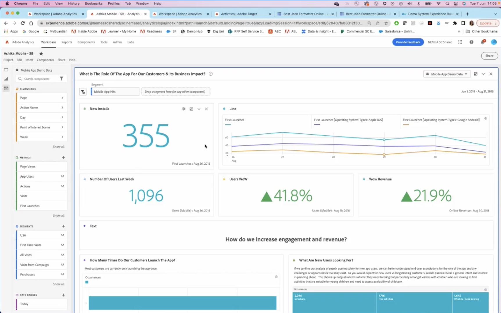

# データとインサイト

組織全体のオンラインとオフラインのデータインサイトを使用して、あらゆるチャネルでリアルタイムのパーソナライゼーションを推進します。

## 最新情報

<table>
<tr>
  <td>
    
     

      <a href="https://experienceleague.adobe.com/docs/events/data-and-insights/2022/personalize.html">
        <strong>Adobe Target を使用したパーソナライズと自動化</strong>
      </a>
    

    

    <em>このセッションに参加して、自動ターゲットと自動パーソナライゼーションを使用したAdobe Target機能の自動化と最適化に関する主要概念について学びましょう。</em>
    

  </td>
  <td>
    
     

      <a href="https://experienceleague.adobe.com/docs/events/data-and-insights/2022/innovations.html">
        <strong>2022 年イノベーションと動向</strong>
      </a>
    

    

    <em>この基調講演では、D&amp;I のトレンドのトップについて学びます。お客様のExperience Cloud投資を最大限に活用し、新しいイノベーションを見据えて、お客様のデータをどのように適切に利用できるかを検討してください。</em>
    

  </td>  
  <td>
    
     

      <a href="https://experienceleague.adobe.com/docs/events/data-and-insights/2022/mobile-and-apps.html">
        <strong>モバイルおよびアプリ用の Analytics および Target アプリケーション</strong>
      </a>
    

    

    <em>このセッションでは、モバイルデバイスでの Analytics ダッシュボードの使用方法に関するベストプラクティスと、Target を使用してアプリをパーソナライズする方法について学びます。</em>
    

  </td>
</tr>
</table>

>[!TIP]
>
>**記録されたすべてのセッションは、左側のナビゲーションに表示されます**.

