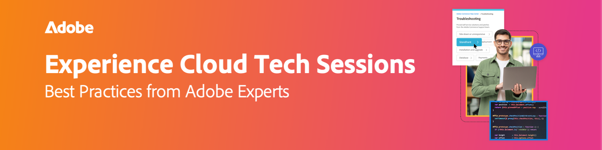

# Experience Cloud Tech Sessions Recordings

{align="center"}

ライブおよびオンデマンドのテクノロジーセッションで、Adobe Experience Cloudの潜在能力を最大限に引き出します。 これらのウェビナーは、従来のサポートを超えて、細部に至るまで配慮されています。 Adobe Adobeのエキスパートが参加するこのセッションでは、陥りがちな落とし穴を回避しながら、技術的なソリューションを自信を持って進めるための貴重なヒント、コツ、戦略を提供します。 Adobeのエキスパートは、最も重要な懸念事項に対処し、日々のケースに積極的に取り組むテクニカルサポートエンジニアです。 ライブオプションとオンデマンド両方に対応し、必要なときにいつでも情報に柔軟にアクセスできるため、シームレスな学習体験を実現できます。

## 2025 セッション

<!-- 
CARDS
{cta = Watch}

* 2025/acc-delivery-performance.md
* 2025/subdomain-ssl-management.md
* 2025/dispatcher-configurations.md
* 2025/fastly-and-adobe-commerce.md
* 2025/getting-most-marketo-measure.md
* 2025/marketo-post-migration.md
* 2025/marketo-pre-migration.md
* 2025/migrate-analytics-to-aep-web-sdk.md
  
-->
<!-- START CARDS HTML - DO NOT MODIFY BY HAND -->

    

        

            

                <figure class="image x-is-16by9">
                    
                </figure>
            

            

                

                    

                        <a href="2025/acc-delivery-performance.md" target="_blank" rel="referrer" title="Adobe Campaign Classic Delivery Performance - トラブルシューティング">Adobe Campaign Classic Delivery Performance - トラブルシューティング </a>
                    

                    
このセッションでは、Adobe Campaignを利用して、電子メールやSMSの配信パフォーマンスを向上させるための主な戦略について解説しました。 配信の遅延、スループットの低下、トランザクションの遅延などの一般的な課題に対処し、バッチ最適化、SQL ロギング、サーバーパフォーマンス監視などのソリューションを提供しました。 配信品質のベストプラクティスには、適切なメール認証（SPF、DKIM、DMARC）、ブラックリストでのモニタリング、迷惑メールのチェックなどが含まれます。 パフォーマンスを向上させるために、専門家はクリーンワークフロー、ルールのスロットル、および共有コンテナの回避を推奨しました。 外部アカウントの適切な設定とログ分析に焦点を当てたSMS配信のヒント。 このセッションでは、追跡検証、膨張レポートを使用したデータベースのメンテナンス、圧力/疲労ルールの適用を強調し、エンゲージメントを高めました。 セッション録画はメールで共有され、Adobe Experience Sitesに投稿されます。

                

                <a href="2025/acc-delivery-performance.md" target="_blank" rel="referrer" class="spectrum-Button spectrum-Button--outline spectrum-Button--primary spectrum-Button--sizeM" style="align-self: flex-start; margin-top: 1rem;">
                    視聴
                </a>
            

        

    

    

        

            

                <figure class="image x-is-16by9">
                    
                </figure>
            

            

                

                    

                        <a href="2025/subdomain-ssl-management.md" target="_blank" rel="referrer" title="技術セッション - Campaign コントロールパネルでのAdobe Campaign サブドメインとSSL管理">技術セッション - Campaign コントロールパネルでのAdobe Campaign サブドメインとSSL管理</a>
                    

                    
Adobe Campaignのドメイン内でサブドメインをデリゲートおよび設定する方法、SSLCampaign コントロールパネルを設定する方法、および安全なメール配信を確保するための設定を監視する方法について説明します。

                

                <a href="2025/subdomain-ssl-management.md" target="_blank" rel="referrer" class="spectrum-Button spectrum-Button--outline spectrum-Button--primary spectrum-Button--sizeM" style="align-self: flex-start; margin-top: 1rem;">
                    視聴
                </a>
            

        

    

    

        

            

                <figure class="image x-is-16by9">
                    
                </figure>
            

            

                

                    

                        <a href="2025/dispatcher-configurations.md" target="_blank" rel="referrer" title="Adobe Experience Manager as a Cloud ServiceでのDispatcher設定">Adobe Experience Manager as a Cloud ServiceのDispatcher設定</a>
                    

                    
AEM as a Cloud Serviceの拡張性と効率性を最大化するキャッシュ、セキュリティ、パフォーマンスに関するAEM Dispatcherのベストプラクティスをご確認ください。

                

                <a href="2025/dispatcher-configurations.md" target="_blank" rel="referrer" class="spectrum-Button spectrum-Button--outline spectrum-Button--primary spectrum-Button--sizeM" style="align-self: flex-start; margin-top: 1rem;">
                    視聴
                </a>
            

        

    

    

        

            

                <figure class="image x-is-16by9">
                    
                </figure>
            

            

                

                    

                        <a href="2025/fastly-and-adobe-commerce.md" target="_blank" rel="referrer" title="FastlyとAdobe Commerce">FastlyとAdobe Commerce</a>
                    

                    
Adobeのサポート戦略、キャッシュのヒント、セルフサービスツールを利用して、デジタルパフォーマンスとセキュリティを向上させ、拡張性のある成功を実現しましょう**

                

                <a href="2025/fastly-and-adobe-commerce.md" target="_blank" rel="referrer" class="spectrum-Button spectrum-Button--outline spectrum-Button--primary spectrum-Button--sizeM" style="align-self: flex-start; margin-top: 1rem;">
                    視聴
                </a>
            

        

    

    

        

            

                <figure class="image x-is-16by9">
                    
                </figure>
            

            

                

                    

                        <a href="2025/getting-most-marketo-measure.md" target="_blank" rel="referrer" title="Marketo Measureを最大限に活用">Marketo Measureを最大限に活用する</a>
                    

                    
チャネルマッピング、セグメンテーション、カスタムステージのマッピング、タッチポイントの抑制に関するベストプラクティスを活用して、Adobe Marketo Measureを最適化できます。 特定のルールを使用して、データを分類し、ステージに論理的に優先順位をつけます。 よりクリーンなデータのために不要な顧客接点を排除。 Boomerang ステージなどのツールを活用し、複雑な設定に対してサポートケースを送信します。 Adobeのエクスペリエンスペリエンスペリエンスペリエンスペリエンスのセッション録画にアクセスします。

                

                <a href="2025/getting-most-marketo-measure.md" target="_blank" rel="referrer" class="spectrum-Button spectrum-Button--outline spectrum-Button--primary spectrum-Button--sizeM" style="align-self: flex-start; margin-top: 1rem;">
                    視聴
                </a>
            

        

    

    

        

            

                <figure class="image x-is-16by9">
                    
                </figure>
            

            

                

                    

                        <a href="2025/marketo-post-migration.md" target="_blank" rel="referrer" title="Adobe Admin ConsoleへのMarketoの移行 – （移行後）">MarketoのAdobe Admin Consoleへの移行 – （移行後） </a>
                    

                    
Adobe Admin ConsoleでMarketoのユーザー管理を一元化。 役割（システム管理、製品管理、プロファイル管理、サポート管理者）およびID タイプ（Adobe、エンタープライズ管理、Federated ID管理）の管理。 シングルサインオン用にSSLを設定し、ユーザー管理を処理し、証明書を3年ごとに更新します。 ログインの問題などの一般的な問題に対処し、ディレクトリの信頼を利用して統合されたエクスペリエンスを実現します。 大規模なユーザーのコンバージョンを500件のバッチに分割します。 AdobeのExperience League ページのセッション録画にアクセスします。

                

                <a href="2025/marketo-post-migration.md" target="_blank" rel="referrer" class="spectrum-Button spectrum-Button--outline spectrum-Button--primary spectrum-Button--sizeM" style="align-self: flex-start; margin-top: 1rem;">
                    視聴
                </a>
            

        

    

    

        

            

                <figure class="image x-is-16by9">
                    
                </figure>
            

            

                

                    

                        <a href="2025/marketo-pre-migration.md" target="_blank" rel="referrer" title="Adobe Admin ConsoleへのMarketoの移行 – （移行前）">MarketoのAdobe Admin Consoleへの移行 – （移行前） </a>
                    

                    
Adobeでは、ユーザー管理を改善するためにMarketo EngageをAdmin Consoleに移行しています。 自動および自己移行の種類、前提条件、移行後の変更、ベストプラクティス、一般的な落とし穴、サポートについて説明します。 AdobeのExperience League web サイトのセッション録画にアクセスします。

                

                <a href="2025/marketo-pre-migration.md" target="_blank" rel="referrer" class="spectrum-Button spectrum-Button--outline spectrum-Button--primary spectrum-Button--sizeM" style="align-self: flex-start; margin-top: 1rem;">
                    視聴
                </a>
            

        

    

    

        

            

                <figure class="image x-is-16by9">
                    
                </figure>
            

            

                

                    

                        <a href="2025/migrate-analytics-to-aep-web-sdk.md" target="_blank" rel="referrer" title="Adobe AnalyticsのAEP Web SDKへの移行">Adobe AnalyticsをAEP Web SDKに移行</a>
                    

                    
appmeasurement.jsおよびat.jsからAEP Web SDK（alloy.js）に移行して、パフォーマンスを向上させ、アーキテクチャを簡素化し、将来に備えてAdobeとの統合を行う方法について説明します。

                

                <a href="2025/migrate-analytics-to-aep-web-sdk.md" target="_blank" rel="referrer" class="spectrum-Button spectrum-Button--outline spectrum-Button--primary spectrum-Button--sizeM" style="align-self: flex-start; margin-top: 1rem;">
                    視聴
                </a>
            

        

    

<!-- END CARDS HTML - DO NOT MODIFY BY HAND -->

## 2024 セッション

<!-- 
CARDS
{cta = Watch}

* 2024/aep-web-sdk-troubleshooting.md
* 2024/ai-assistant.md
* 2024/champion-office-hours.md
* 2024/rtcdp-timings.md
* 2024/tracking-visitors.md

-->
<!-- START CARDS HTML - DO NOT MODIFY BY HAND -->

    

        

            

                <figure class="image x-is-16by9">
                    
                </figure>
            

            

                

                    

                        <a href="2024/aep-web-sdk-troubleshooting.md" target="_blank" rel="referrer" title="AEP Web SDKのトラブルシューティング、Assurance、およびヒントとテクニック">AEP Web SDK のトラブルシューティング、アシュランス、ヒントとテクニック</a>
                    

                    
RTCDP、Adobe Analyticsのデータ収集と、一般的な実装上の課題への対応に焦点を当てた、AEP Web SDK ワークフローのトラブルシューティングに関する包括的なセッションをGarrett Hartleyが開催します。

                

                <a href="2024/aep-web-sdk-troubleshooting.md" target="_blank" rel="referrer" class="spectrum-Button spectrum-Button--outline spectrum-Button--primary spectrum-Button--sizeM" style="align-self: flex-start; margin-top: 1rem;">
                    視聴
                </a>
            

        

    

    

        

            

                <figure class="image x-is-16by9">
                    
                </figure>
            

            

                

                    

                        <a href="2024/ai-assistant.md" target="_blank" rel="referrer" title="Adobe Experience PlatformのAI アシスタントで生産性を向上">Adobe Experience PlatformのAI アシスタントで生産性を向上</a>
                    

                    
Rachel Hanessian氏とAriel Sultan氏が参加するインサイトに満ちたウェビナーでは、AI アシスタントを使用してReal-Time CDP、Journey Optimizer、Customer Journey Analyticsの生産性を向上させるユースケースを、設定する方法や導入する方法を学ぶことができます。

                

                <a href="2024/ai-assistant.md" target="_blank" rel="referrer" class="spectrum-Button spectrum-Button--outline spectrum-Button--primary spectrum-Button--sizeM" style="align-self: flex-start; margin-top: 1rem;">
                    視聴
                </a>
            

        

    

    

        

            

                <figure class="image x-is-16by9">
                    
                </figure>
            

            

                

                    

                        <a href="2024/champion-office-hours.md" target="_blank" rel="referrer" title="Marketo Engage Champion テクノロジーセッション - 2024年5月">Marketo Engage Champion テクニカルセッション - 2024年5月</a>
                    

                    
5月に開催されるAdobe Marketo Champion Tech Sessionsでは、ChampionのChris Kelley氏、Sarah Ryan氏、Jimmy Spencer氏、Briney Young氏とモデレーターのCourtny Edwards-Jones氏が参加します。Adobe Marketoを初めて利用する場合でも、スキルアップを目指している場合でも、Championが専門知識を共有します。

                

                <a href="2024/champion-office-hours.md" target="_blank" rel="referrer" class="spectrum-Button spectrum-Button--outline spectrum-Button--primary spectrum-Button--sizeM" style="align-self: flex-start; margin-top: 1rem;">
                    視聴
                </a>
            

        

    

    

        

            

                <figure class="image x-is-16by9">
                    
                </figure>
            

            

                

                    

                        <a href="2024/rtcdp-timings.md" target="_blank" rel="referrer" title="Adobe Real-Time CDPのタイミングと期待値"> リアルタイム コンテンツ データ プラットフォームのタイミングと期待できること</a>
                    

                    
AdobeのグローバルリードであるSeth Burke氏によるインサイトに満ちたウェビナーでは、Adobe Real-Time CDP （RTCDP）を活用するためのベストプラクティスを解説しています。 Sethは、データの取り込み、オーディエンスの評価、書き出しのタイミングに関する複雑なガイダンスを提供し、各ステージにおける主な制限事項を強調します。

                

                <a href="2024/rtcdp-timings.md" target="_blank" rel="referrer" class="spectrum-Button spectrum-Button--outline spectrum-Button--primary spectrum-Button--sizeM" style="align-self: flex-start; margin-top: 1rem;">
                    視聴
                </a>
            

        

    

    

        

            

                <figure class="image x-is-16by9">
                    
                </figure>
            

            

                

                    

                        <a href="2024/tracking-visitors.md" target="_blank" rel="referrer" title="変化し続けるCookie、ブラウザー、ライブラリにおける訪問者のトラッキング">変化し続けるCookie、ブラウザー、ライブラリの状況における訪問者のトラッキング </a>
                    

                    
Adobeのカスタマーエクスペリエンス部門のシニアテクニカルサポートエンジニアであるGarrett Hartley氏を特集した有益なウェビナーにご参加ください。 このセッションでは、進化する今日のCookie、ブラウザー、ライブラリに関する訪問者を追跡するためのベストプラクティスをGarrettが共有します。以前の実装戦略を確認し、最新の訪問者トラッキング方法を採用するための効果的な移行パスを探ります。 時代遅れの神話を暴露し、追跡システムを改善するための最先端のアプローチについて学ぶことができます。

                

                <a href="2024/tracking-visitors.md" target="_blank" rel="referrer" class="spectrum-Button spectrum-Button--outline spectrum-Button--primary spectrum-Button--sizeM" style="align-self: flex-start; margin-top: 1rem;">
                    視聴
                </a>
            

        

    

<!-- END CARDS HTML - DO NOT MODIFY BY HAND -->

## 2023 セッション

<!-- 
CARDS

{cta = Watch}

* 2023/ac-sms-channel-overview.md
* 2023/aem-deployment-failures-analysis.md
* 2023/aem-forms-headless-architecture.md
* 2023/aep-admin-console-permissions.md
* 2023/launch-best-practices.md
* 2023/marketo-common-pitfalls.md
* 2023/migration-aemcs.md
* 2023/optimize-indexes-aemcs.md
* 2023/site-wide-analysis-tool.md
* 2023/target-debugging-tips-and-tricks.md
* 2023/workfront-fix-duplicate-contacts.md
* 2023/workfront-proof-approval-reports.md

-->
<!-- START CARDS HTML - DO NOT MODIFY BY HAND -->

    

        

            

                <figure class="image x-is-16by9">
                    
                </figure>
            

            

                

                    

                        <a href="2023/ac-sms-channel-overview.md" target="_blank" rel="referrer" title="SMS チャネルの概要とトラブルシューティングのヒント">SMS チャネルの概要とトラブルシューティングのヒント </a>
                    

                    
SMS アーキテクチャ、SMS チャネルの設定、SMPP外部アカウントの設定、SMS配信の作成、およびトラブルシューティングについて説明します。

                

                <a href="2023/ac-sms-channel-overview.md" target="_blank" rel="referrer" class="spectrum-Button spectrum-Button--outline spectrum-Button--primary spectrum-Button--sizeM" style="align-self: flex-start; margin-top: 1rem;">
                    視聴
                </a>
            

        

    

    

        

            

                <figure class="image x-is-16by9">
                    
                </figure>
            

            

                

                    

                        <a href="2023/aem-deployment-failures-analysis.md" target="_blank" rel="referrer" title="AEM as a Cloud Serviceのデプロイメントエラーの分析">AEM as a Cloud Serviceのデプロイメント エラーの分析</a>
                    

                    
AEM as a Cloud Serviceのデプロイメントの内部構造とトラブルシューティングを示します。

                

                <a href="2023/aem-deployment-failures-analysis.md" target="_blank" rel="referrer" class="spectrum-Button spectrum-Button--outline spectrum-Button--primary spectrum-Button--sizeM" style="align-self: flex-start; margin-top: 1rem;">
                    視聴
                </a>
            

        

    

    

        

            

                <figure class="image x-is-16by9">
                    
                </figure>
            

            

                

                    

                        <a href="2023/aem-forms-headless-architecture.md" target="_blank" rel="referrer" title="AEM Formsのヘッドレスアーキテクチャ">AEM Forms ヘッドレスアーキテクチャ </a>
                    

                    
ヘッドレスアーキテクチャの概要、AEM Forms ヘッドレスの利点、ライブデモ。

                

                <a href="2023/aem-forms-headless-architecture.md" target="_blank" rel="referrer" class="spectrum-Button spectrum-Button--outline spectrum-Button--primary spectrum-Button--sizeM" style="align-self: flex-start; margin-top: 1rem;">
                    視聴
                </a>
            

        

    

    

        

            

                <figure class="image x-is-16by9">
                    
                </figure>
            

            

                

                    

                        <a href="2023/aep-admin-console-permissions.md" target="_blank" rel="referrer" title="Adobe Experience Platform - Admin Console権限">Adobe Experience Platform - Admin Console権限</a>
                    

                    
Admin Consoleと変更内容、RTCDP UI、Adobe.io/developer コンソール内の新しいアクセス制御、およびRTCDP API統合の権限を設定する方法。

                

                <a href="2023/aep-admin-console-permissions.md" target="_blank" rel="referrer" class="spectrum-Button spectrum-Button--outline spectrum-Button--primary spectrum-Button--sizeM" style="align-self: flex-start; margin-top: 1rem;">
                    視聴
                </a>
            

        

    

    

        

            

                <figure class="image x-is-16by9">
                    
                </figure>
            

            

                

                    

                        <a href="2023/launch-best-practices.md" target="_blank" rel="referrer" title="ローンチのベストプラクティス"> ローンチのベストプラクティス </a>
                    

                    
このセッションでは、構成、設定、落とし穴、活用が不十分な機能、一般的なトラブルシューティングワークフローについて説明します。

                

                <a href="2023/launch-best-practices.md" target="_blank" rel="referrer" class="spectrum-Button spectrum-Button--outline spectrum-Button--primary spectrum-Button--sizeM" style="align-self: flex-start; margin-top: 1rem;">
                    視聴
                </a>
            

        

    

    

        

            

                <figure class="image x-is-16by9">
                    
                </figure>
            

            

                

                    

                        <a href="2023/marketo-common-pitfalls.md" target="_blank" rel="referrer" title="高度なスマートリストロジックと一般的な落とし穴">高度なスマート リスト ロジックと一般的な落とし穴</a>
                    

                    
複雑で高度なスマートリストロジック、ALL、ANY、高度なフィルター、複数のトリガー、ネガティブフィルターとネガティブな制約、一般的な問題、トラブルシューティングのヒントの概要

                

                <a href="2023/marketo-common-pitfalls.md" target="_blank" rel="referrer" class="spectrum-Button spectrum-Button--outline spectrum-Button--primary spectrum-Button--sizeM" style="align-self: flex-start; margin-top: 1rem;">
                    視聴
                </a>
            

        

    

    

        

            

                <figure class="image x-is-16by9">
                    
                </figure>
            

            

                

                    

                        <a href="2023/migration-aemcs.md" target="_blank" rel="referrer" title="AEM Cloud Serviceへの移行">AEM Cloud Serviceへの移行</a>
                    

                    
AEM Cloud Serviceへの移行を容易にするために利用できるテクニックとツールについて説明します。 コンテンツ転送ツールから、ベストプラクティスアナライザーと組み合わせて使用される新しいCloud Acceleration Managerに移動して、環境を評価します。

                

                <a href="2023/migration-aemcs.md" target="_blank" rel="referrer" class="spectrum-Button spectrum-Button--outline spectrum-Button--primary spectrum-Button--sizeM" style="align-self: flex-start; margin-top: 1rem;">
                    視聴
                </a>
            

        

    

    

        

            

                <figure class="image x-is-16by9">
                    
                </figure>
            

            

                

                    

                        <a href="2023/optimize-indexes-aemcs.md" target="_blank" rel="referrer" title="AEM Cloud Serviceでのインデックスの最適化のための基盤">AEM Cloud Serviceでインデックスを最適化するための基盤</a>
                    

                    
AEM CSのインデックス作成の変更と、それが様々なプロジェクトに与える影響、AEMaaCSのインデックスに関するお客様の課題、およびこれらのインデックスを最適化するためのベストプラクティス

                

                <a href="2023/optimize-indexes-aemcs.md" target="_blank" rel="referrer" class="spectrum-Button spectrum-Button--outline spectrum-Button--primary spectrum-Button--sizeM" style="align-self: flex-start; margin-top: 1rem;">
                    視聴
                </a>
            

        

    

    

        

            

                <figure class="image x-is-16by9">
                    
                </figure>
            

            

                

                    

                        <a href="2023/site-wide-analysis-tool.md" target="_blank" rel="referrer" title="サイト全体の分析ツール"> サイト全体の分析ツール </a>
                    

                    
このセッションでは、SWATの概要とライブデモ（SWAT Cloud Sandbox）について説明します

                

                <a href="2023/site-wide-analysis-tool.md" target="_blank" rel="referrer" class="spectrum-Button spectrum-Button--outline spectrum-Button--primary spectrum-Button--sizeM" style="align-self: flex-start; margin-top: 1rem;">
                    視聴
                </a>
            

        

    

    

        

            

                <figure class="image x-is-16by9">
                    
                </figure>
            

            

                

                    

                        <a href="2023/target-debugging-tips-and-tricks.md" target="_blank" rel="referrer" title="JavaScript ライブラリの概要，デバッグのヒントとテクニック">JavaScript ライブラリの概要、デバッグのヒントとテクニック </a>
                    

                    
最新のリリースと機能、at.jsのデバッグ方法、ライブデモのトラブルシューティング、セルフサポートリソース、サポートとのエンゲージメント方法などです。

                

                <a href="2023/target-debugging-tips-and-tricks.md" target="_blank" rel="referrer" class="spectrum-Button spectrum-Button--outline spectrum-Button--primary spectrum-Button--sizeM" style="align-self: flex-start; margin-top: 1rem;">
                    視聴
                </a>
            

        

    

    

        

            

                <figure class="image x-is-16by9">
                    
                </figure>
            

            

                

                    

                        <a href="2023/workfront-fix-duplicate-contacts.md" target="_blank" rel="referrer" title="重複した連絡先の修正">重複する連絡先の修正</a>
                    

                    
プルーフの作成方法、連絡先の同期の問題を特定および解決する方法、プルーフ生成エラーを解決する方法を参照してください。

                

                <a href="2023/workfront-fix-duplicate-contacts.md" target="_blank" rel="referrer" class="spectrum-Button spectrum-Button--outline spectrum-Button--primary spectrum-Button--sizeM" style="align-self: flex-start; margin-top: 1rem;">
                    視聴
                </a>
            

        

    

    

        

            

                <figure class="image x-is-16by9">
                    
                </figure>
            

            

                

                    

                        <a href="2023/workfront-proof-approval-reports.md" target="_blank" rel="referrer" title="プルーフ承認レポート"> プルーフ承認レポート </a>
                    

                    
プルーフ承認レポートの作成方法について説明します。

                

                <a href="2023/workfront-proof-approval-reports.md" target="_blank" rel="referrer" class="spectrum-Button spectrum-Button--outline spectrum-Button--primary spectrum-Button--sizeM" style="align-self: flex-start; margin-top: 1rem;">
                    視聴
                </a>
            

        

    

<!-- END CARDS HTML - DO NOT MODIFY BY HAND -->
