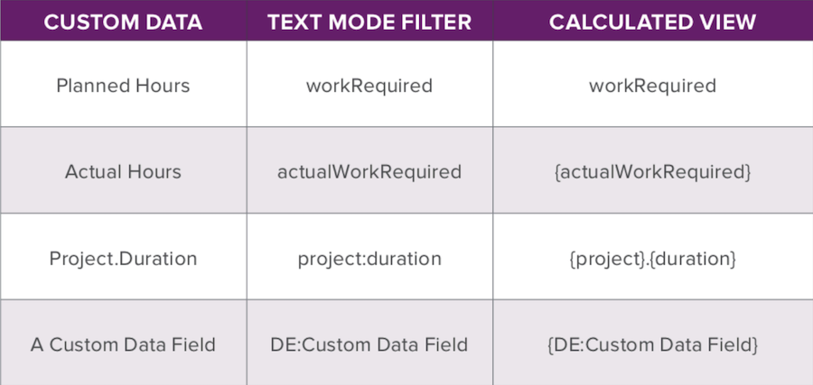

# エキスパートに問い合わせる – API エクスプローラーを使用した基本テキストモードレポートの強化

[[!UICONTROL API Explorer]](https://developer.adobe.com/workfront/api-explorer/)の概要、使用方法、および基本テキストモードを使用してレポートを強化する方法について説明します。 このウェビナーは2020年1月22日に録画されました。

>[!VIDEO](https://video.tv.adobe.com/v/341124/?quality=12)

## その他のリソース




**最終「すべての担当業務」列**

```
description="Primary =" indicates the user's primary job role
displayname=All Job Roles
listdelimiter=<p>
listmethod=nested(userRoles).lists
textmode=true
type=iterate
valueexpression=IF({user}.{roleID}={role}.{ID},CONCAT("Primary = ",{role}.{name}),{role}.{name})
valueformat=HTML
```

「すべてのチーム」列の&#x200B;**テキストモード**

```
displayname=All Teams
listdelimiter=<p>
listmethod=nested(teams).lists
textmode=true
type=iterate
valueexpression={name}
valueformat=HTML
```

「すべてのグループ」列の&#x200B;**テキストモード**

```
displayname=All Groups
listdelimiter=<p>
listmethod=nested(userGroups).lists
textmode=true
type=iterate
valuefield=group:name
valueformat=HTML
```

「ダイレクトレポート」列の&#x200B;**テキストモード**

```
displayname=Direct Reports
listdelimiter=<p>
listmethod=nested(directReports).lists
textmode=true
type=iterate
valueexpression={name}
valueformat=HTML
```

## Q&amp;A

**質問**

テキストモードを使用して、レポートで任意のコレクションを使用できますか？

**回答**

はい、コレクション領域で任意のオブジェクトを使用できます。 アクセスできるデータについて確認します。 API エクスプローラーのUser Roles オブジェクトで見たように、すべてがユーザーオブジェクトとジョブロールオブジェクトの両方にアクセスできるわけではありません。

**質問**

「同じ列での異なるコレクションの条件付き使用（プロジェクトの更新とタスクの更新）」について説明できます

**回答**

イテレーション領域でvaluefieldまたはvalueexpressionが表示されている場合、コレクションリストの項目の1つにアクセスします。 value フィールドを使用すると、例えば、そのジョブロールの名前や、リスト内のその項目に含まれるすべての名前を取得できます。 タスクに取り組んでいる場合、タスクオブジェクトは、そのタスクの属するプロジェクトを参照できます。

**質問**

「タスク更新コレクションはタスクレポートでのみ可能ですか？」と問い合わせます。

**回答**

問題レポートを作成する際に、問題がタスクに対して報告された場合は、タスク情報を確認できます。また、コレクション内からその情報を確認することもできます。 ただし、タスク収集データを確認するには、タスクレポートを使用する必要があります。

**質問**

テキスト形式（[!DNL CSS]）の例を共有できますか？

**回答**

Workfrontは、テキストモードで[!DNL CSS]をサポートしていません。

**質問**

テキストモードレポート用のカスタムフィールド名を見つけるための最適な方法と最速の方法は何ですか？ 私は、ブラウザーでHTML編集オプションを使用しました。または、レポートにフィールドを追加し、テキストモードに切り替えてテキストを取得しましたが、他の人がこれをどのように実行するのか興味があります

**回答**

UIでフィールドを選択し、テキストモードに切り替えてフィールド名をコピーするのが最も簡単です。 これにより、フィールドのスペルが正しくなります。

**質問**

テキストモードを使用して、レポート内のチームのメンバーを識別するにはどうすればよいですか？ 現在、タスク承認ワークフローでチームの割り当てを使用しており、「承認者とステータス」フィールドの動作に類似した列に、現在の承認ステージのチームメンバーをリストしたいと考えています。

**回答**

現在の承認ステージに関連付けられているチームメンバーを参照するには、参照コレクションのコレクションを参照する必要がありますが、これは現在Workfrontのテキストモード機能では不可能です。 承認に関連付けられているチームを示す、組織が現在使用している列が最適なオプションです。

**質問**

フィールド名とオブジェクト名は適切な大文字と小文字にする必要があります（例： 役割vs役割）?

**回答**

テキストモードでオブジェクトを参照する場合は、API エクスプローラーの右側の列が示すように、正確に書き込む必要があります。 例えば、タスクレポートからプロジェクト名を参照する場合、値フィールドは次のようになります。

```
valuefield=project:name
```

ただし、イシューの場合、これらはAPI エクスプローラーでopTasksと呼ばれます。 時間レポートを実行し、イシュー名に列を追加する場合、値フィールドは
例えば、次のようになります。

```
valuefield=opTask:name
```

**質問**

現在アクティブなタスクが取り組んでいる各プロジェクトを示すレポートを作成しようと考えています。 どうすればよいでしょうか？ プロジェクト情報列も追加されたタスクレポートだと思いますか？

**回答**

その通りです。 タスクレポートが最適です。 「アクティブタスク」を定義する必要があります。 先行タスクを使用している場合は、準備完了のタスクになります。 Ready = Trueでフィルタリングできます。 これにより、開始準備ができているタスクが呼び出されます。 次に、プロジェクト名でグループ化することをお勧めします。これにより、タスクはすべてグループ化され、どのタスクがどのプロジェクトに属しているかが一目で確認できます。

**質問**

データを計算するレポートを作成する方法はありますか？例えば、特定の基準を満たすプロジェクトの割合などを作成できますか？

**回答**

レポートを作成してデータを表示または計算する最適な方法は、グループ化をレポートに適用してからグラフを適用することです（例：%）。 円グラフをレポートに追加する場合は、円スライスを値またはパーセントで指定するオプションがあります。

**質問**

テキストモードを使用して、承認者とステータス列と同様に、現在のタスク承認ステージに割り当てられているチームのメンバーを特定できますか？

**回答**

タスクレポートには、次のようなコレクション列をテキストモードで追加する必要があります。

```
displayname=Current Approval Stage Approvers 
listdelimiter=<p> 
listmethod=nested(currentApprovalStep.stepApprovers).lists 
textmode=true
type=iterate 
valuefield=user:name 
valueformat=HTML
```

**質問**

すべてのグループに特定のグループが含まれる場所をフィルタリングできますか？

**回答**

レポート内の項目をフィルタリングする場合は、レポートの「フィルター」タブでフィルタリングします。 グループの1つがアカウンティングであるユーザーのみを表示したい場合は、次のようなフィルタールールを追加します。

```
Other Groups>ID>Equal>Accounting
```

**質問**

タスクの組み合わせの実際の期間を決定するレポートを作成する方法はありますか？

**回答**

必要なタスクの組み合わせのみを含めるように、レポートをフィルタリングする必要があります。 次に、実際の期間の列をビューに配置し、列設定で合計で要約する必要があります。最後に、レポートを何らかの方法でグループ化する必要があります。 レポートを実行すると、グループ化バーには、グループ化されている行に含まれている実際の期間の合計が表示されます。

**質問**

親に該当するタスクを減算して、親の下にある残りのタスクの期間を決定する方法はありますか？

**回答**

親タスクの期間は、最古の開始タスクの開始日を、その親の下にある最新の終了タスクの終了日から減算して計算されます。 レポートでは、表示するかどうかを検討する個々のタスクについてのみ把握できます。 レポートエンジンは、あるタスクの情報に依存し、別のタスクを調べるときにそれを使用する方法はありません。 したがって、要求することを達成する唯一の方法は、プロジェクトタスクリスト内の特定の親の下にあるタスクを削除し、親タスクの期間がどのように再計算されるかを確認することです。

**質問**

条件付きグループ化の場合、個々のグループをデコードするためのカスタムフォーム（「Western States」、「Central States」、「Eastern States」）は、計算されたグループ化と計算されたパラメーターの使用を推奨する場合に、そのメモでうまく機能する一般的な手法です。

**回答**

計算されたグループ化（グループ化の場合は値の式）は、グループ化バーに表示する結果を取得する便利な方法です。 これは、計算されたカスタムフィールドを使用して実行することもできます。 各アプローチには、次のような長所と短所があります。

* 値の式は、ブラウザーページが更新されるたびに計算されます。 これは、関連付けられているオブジェクトが編集されるたびに再計算される計算カスタムフィールドや、計算フィールドが一括編集で再計算される場合、またはカスタムフォームが編集され、「以前の計算を更新」オプションが選択されている場合に再計算される計算カスタムフィールドよりも優れています。
* ただし、値式は、チャート、条件付き書式、フィルターでは使用できません。 これには、計算カスタムフィールドを使用する必要があります。

**質問**

グループ化表示名を「値なし」から、レポート用に呼び出す他の名前に変更する方法はありますか？ つまり、常に「価値なし」ということになります。

**回答**

「値なし」を別の値に置き換える方法があります。 Portfolio名でグループ化されたプロジェクトレポートがあるとします。 ポートフォリオに割り当てられていないすべてのプロジェクトは、タイトル付きのグループ化になります。

```
Portfolio: Name: No Value
```

これを変更するには、テキストモードでグループ化を編集し、この行を置き換えます。

```
group.0.valuefield=portfolio:name
```

この行で：

```
group.0.valueexpression=IF(ISBLANK({portfolio}.{name}),"Not in any Portfolio",{portfolio}.{name})
```

グループ化のタイトルは次のようになります。

```
Portfolio: Name: Not in any Portfolio
```

**質問**

不完全な割り当てを追跡するパラメーターがあります（例：）。

1. 個人が割り当てられなかった、または割り当てられたタスク
1. リクエストされた役割に対して少なくとも1人の未割り当て個人が割り当てられている複数の割り当てがあるタスク

**回答**

これは、割り当てレポートを使用し、次のようにフィルタリングすることで実現できます

```
Assigned To ID > Is Blank and Role ID > Is Not Blank
```

これにより、役割に割り当てられたすべてのタスクやイシューが取り込まれますが、必ずしも特定のユーザーが取り込まれるわけではありません。 タスクとイシュー名の列を追加して、割り当てが属するオブジェクトを確認し、プロジェクト名でグループ化した場合は、それを整理するのに役立ちます。

**質問**

チャック、忘れてるけど、テキストモードでプロパティを思い出してください。プロパティがツールチップとして表示されます。カーソルを合わせると？

**回答**

description=列ヘッダーにカーソルを合わせると、ツールチップを表示できます。

**質問**

複数の選択が可能で、最初の選択のみをレポートに取り込むチェックボックスフィールドについてレポートを作成できますか？

**回答**

はい。 チェックボックスフィールドで選択した選択肢は、すべて1つの文字列で構成され、各選択肢はコンマで区切られます。 検索式を使用して、チェックボックスフィールド内の最初のコンマの位置を見つけ、そのインデックスをLEFT式と共に使用して、リストの先頭からその多くの文字を表示します。 以下がコードです。

```
valueexpression=IF(SEARCH(",",{DE:Checkbox Field},0)>0,LEFT({DE:Checkbox Field},SEARCH(",",{DE:Checkbox Field},0)),{DE:Checkbox Field})
```

チェックボックスフィールドで選択範囲の名前にコンマを使用すると、最初のコンマまでの選択範囲の一部のみが表示されます。
