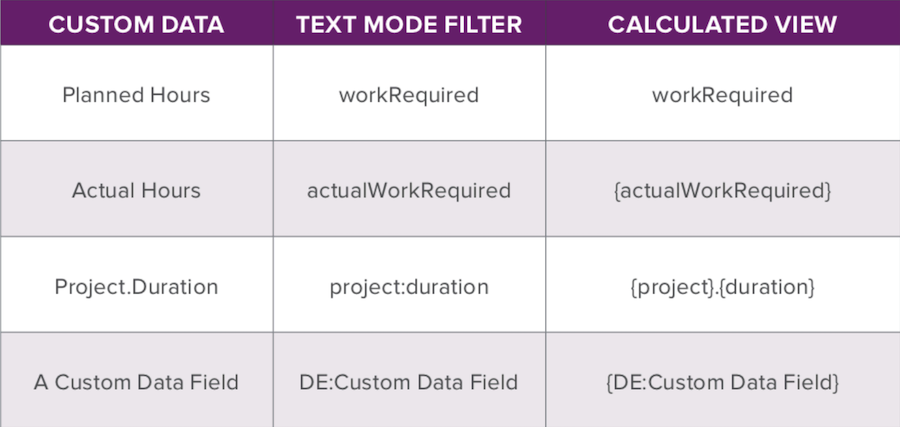

# API エクスプローラーを使用したエキスパートへの質問 — Supercharge 基本テキストモードのレポート

詳しくは、 [[!UICONTROL API エクスプローラ]](https://developer.adobe.com/workfront/api-explorer/)、基本テキストモードを活用してレポートを拡張する方法を説明します。 このウェビナーは 2020 年 1 月 22 日に録画されました。

>[!VIDEO](https://video.tv.adobe.com/v/341124/?quality=12)

## その他のリソース




**最終的な「すべてのジョブの役割」列**

```
description="Primary =" indicates the user's primary job role
displayname=All Job Roles
listdelimiter=<p>
listmethod=nested(userRoles).lists
textmode=true
type=iterate
valueexpression=IF({user}.{roleID}={role}.{ID},CONCAT("Primary = ",{role}.{name}),{role}.{name})
valueformat=HTML
```

**「すべてのチーム」列のテキストモード**

```
displayname=All Teams
listdelimiter=<p>
listmethod=nested(teams).lists
textmode=true
type=iterate
valueexpression={name}
valueformat=HTML
```

**「すべてのグループ」列のテキストモード**

```
displayname=All Groups
listdelimiter=<p>
listmethod=nested(userGroups).lists
textmode=true
type=iterate
valuefield=group:name
valueformat=HTML
```

**「ダイレクトレポート」列のテキストモード**

```
displayname=Direct Reports
listdelimiter=<p>
listmethod=nested(directReports).lists
textmode=true
type=iterate
valueexpression={name}
valueformat=HTML
```

## Q&amp;A

**質問**

テキストモードを使用して、レポート内で任意のコレクションを使用できますか？

**回答**

はい、コレクション領域に任意のオブジェクトを使用できます。 アクセス権を調べて表示します。 API エクスプローラーでユーザーロールオブジェクトと共に見たように、すべてのユーザーオブジェクトとジョブロールオブジェクトの両方にアクセスできるわけではありません。

**質問**

「同じ列の異なるコレクションの条件付き使用（プロジェクトの更新とタスクの更新）」について話し合うことができますか？

**回答**

繰り返し領域に値フィールドまたは値の式が表示された場合、それはコレクションリストの項目の 1 つにアクセスします。 value フィールドを使用して、そのジョブの役割の名前（例： ）、またはリスト内のその項目に含まれる任意の名前を取得できます。 タスク内にいる場合、タスクオブジェクトはそのタスク内のプロジェクトを参照できます。

**質問**

「タスクの更新の収集はタスクレポートでのみ可能かどうか」について話し合うことができますか？

**回答**

イシューレポートを作成すると、イシューがタスクに対してレポートされた場合はタスク情報を確認でき、コレクション内からもその情報を確認できます。 タスク収集データを確認するには、タスクレポートに表示する必要があります。

**質問**

テキスト形式 ([!DNL CSS]) 例？

**回答**

Workfrontは [!DNL CSS] （テキストモード）。

**質問**

テキストモードでのレポート用に、カスタムフィールド名を検索する最も良い方法と最も迅速な方法を教えてください。 ブラウザのHTML編集オプションを使用した OR、レポートにフィールドを追加してテキストモードに切り替え、取得する BUT...他のユーザーがこの操作を実行する方法を知りたい

**回答**

UI でフィールドを選択し、テキストモードに切り替えて、フィールド名をコピーするのが最も簡単です。 これにより、フィールドのスペルが正しくなります。

**質問**

テキストモードを使用してレポート内のチームのメンバーを識別する方法を教えてください。 現在、タスク承認ワークフローでチームの割り当てを使用していますが、「承認者とステータス」フィールドの動作と同様に、現在の承認ステージのチームメンバーを列に表示したいと考えています。

**回答**

現在の承認ステージに関連付けられたチームメンバーを参照するには、参照されたコレクションのコレクションを参照する必要があります。これは、Workfrontのテキストモード機能では現在使用できません。 組織が現在使用している列で、承認に関連付けられたチームを示すのが最適なオプションです。

**質問**

フィールド名とオブジェクト名は、大文字と小文字を区別する必要がありますか ( 例： 役割と役割の違い )?

**回答**

テキストモードでオブジェクトを参照する場合、API エクスプローラーの右側の列に示すとおりに書き込む必要があります。 たとえば、タスクレポートからプロジェクト名を参照する場合、値フィールドは次のようになります。

```
valuefield=project:name
```

ただし、問題の場合、API エクスプローラーでは opTasks と呼ばれます。 したがって、時間レポートを実行し、問題名の列を追加する場合、値フィールドは次のようになります。

```
valuefield=opTask:name
```

**質問**

各プロジェクトに関して、現在作業中のタスクを示すレポートを作成したいと考えています。 私はそれをどうすれば良いでしょうか？ プロジェクト情報の列も追加されたタスクレポートだと思います。

**回答**

それは正しい。 タスクレポートはこの場合に最適です。 「アクティブなタスク」を定義する必要があります。 先行タスクを使用している場合は、[ 準備完了 ] のタスクになります。 したがって、Ready = True でフィルタリングできます。 これにより、「準備完了」のタスクが取り込まれます。 次に、プロジェクト名でグループ化することをお勧めします。この方法で、タスクをすべてグループ化し、どのタスクがどのプロジェクトに属しているかを一目で確認できます。

**質問**

特定の条件を満たすプロジェクトの割合など、データを計算するレポートを作成する方法はありますか。

**回答**

データを表示または計算するレポートを作成する最善の方法（例：割合）は、レポートにグループ化を適用し、グラフを適用することです。 レポートに円グラフを追加する場合、円グラフを値または割合で表示するオプションがあります。

**質問**

テキストモードを使用して、「承認者とステータス」列と同様に、現在のタスク承認ステージに割り当てられているチームのメンバーを識別できますか？

**回答**

次の情報を含むコレクション列をテキストモードでタスクレポートに追加する必要があります。

```
displayname=Current Approval Stage Approvers 
listdelimiter=<p> 
listmethod=nested(currentApprovalStep.stepApprovers).lists 
textmode=true
type=iterate 
valuefield=user:name 
valueformat=HTML
```

**質問**

すべてのグループに特定のグループが含まれる場合にフィルタリングできますか？

**回答**

レポート内の項目をフィルタリングする場合は、レポートの「フィルター」タブでフィルタリングします。 そのため、グループの 1 つが Accounting であるユーザーのみを表示する場合は、次のようなフィルタルールを追加します。

```
Other Groups>ID>Equal>Accounting
```

**質問**

タスクの組み合わせの実際の期間を判断するレポートを作成する方法はありますか？

**回答**

レポートにフィルターを適用して、必要なタスクの組み合わせのみを含める必要があります。 次に、ビューに実際の期間の列を配置し、列設定の合計で要約し、最後に何らかの方法でレポートをグループ化する必要があります。 レポートを実行すると、グループ化バーに、グループ化する行に含まれる実際の期間の合計が表示されます。

**質問**

親の下にある残りのタスクの期間を決定するために、親の下にあるタスクを減算する方法はありますか？

**回答**

親タスクの期間は、最も早いタスクの開始日を、その親の下にある最も遅い終了タスクの終了日から引くことで計算されます。 レポートでは、表示するかどうかを考慮する個々のタスクについてのみ把握できます。 レポートエンジンでは、あるタスクの情報にしがみつき、別のタスクを見るときにその情報を使用することはできません。 したがって、タスクを実行する唯一の方法は、プロジェクトタスクリスト内でタスクが特定の親の下に置かれている状態からタスクを削除し、親タスクの期間が再計算される方法を確認することです。

**質問**

条件付きグループの場合、個々のグループをデコードするカスタムフォーム（「西部の州」、「中央の州」、「東部の州」と考えてください）は、計算グループと計算パラメーターのどちらを使用すればよいですか？

**回答**

計算されたグループ（グループ内の値の式とも呼ばれます）は、結果をグループ化バーに表示する便利な方法です。 これは、計算カスタムフィールドを使用しておこなうこともできます。 各アプローチには、次のような長所と短所があります。

* 値の式は、ブラウザーページが更新されるたびに計算されます。 この方が、関連付けられたオブジェクトが編集されたとき、または一括編集で計算フィールドが再計算されたとき、またはカスタムフォームが編集されて「以前の計算を更新」オプションが選択されたときに再計算される計算カスタムフィールドよりも適しています。
* ただし、値の式は、グラフ、条件付き書式、フィルタでは使用できません。 これらには、計算カスタムフィールドを使用する必要があります。

**質問**

グループ化の表示名を「値なし」からレポート目的で呼び出す他の設定に変更する方法はありませんか？ つまり、常に「値なし」になります。

**回答**

「値なし」を別の値に置き換える方法があります。 プロジェクト名別にグループ化されたプロジェクトレポートがあるとします。Portfolio名別にグループ化されたプロジェクトレポートがあるとします。 ポートフォリオに割り当てられていないプロジェクトは、最終的に次のタイトルでグループ化されます。

```
Portfolio: Name: No Value
```

これを変更するには、次の行をテキストモードでグループ化を編集し、次の行に置き換えます。

```
group.0.valuefield=portfolio:name
```

を次の行に置き換えます。

```
group.0.valueexpression=IF(ISBLANK({portfolio}.{name}),"Not in any Portfolio",{portfolio}.{name})
```

グループ化のタイトルは次のようになります。

```
Portfolio: Name: Not in any Portfolio
```

**質問**

不完全な割り当てを追跡するためのパラメータがあるか。例：

1. 個人を割り当てていない、単一の割り当てを持つタスク、または
1. リクエストされたロールの個人が 1 つ以上割り当てられていない複数の割り当てを持つタスク

**回答**

これは、割り当てレポートとフィルタリングを使用して、

```
Assigned To ID > Is Blank and Role ID > Is Not Blank
```

これにより、ロールに割り当てられたすべてのタスクまたはイシューが取り込まれますが、特定のユーザーである必要はありません。 割り当てが属するオブジェクトを確認するには、タスクとイシュー名の列を追加する必要があります。プロジェクト名でグループ化すると、タスクを整理し続けるのに役立ちます。

**質問**

チャック忘れてるけどテキストモードでプロパティを思い出すの？

**回答**

description=列ヘッダーにカーソルを合わせると、ツールチップを表示できます。

**質問**

複数選択可能で、最初の選択項目のみをレポートに取り込むチェックボックスフィールドについてレポートを作成できますか？

**回答**

はい。チェックボックスフィールドで選択した選択肢は、すべて 1 つの文字列で、各選択項目がコンマで区切られます。 SEARCH 式を使用してチェックボックスフィールド内の最初のコンマの位置を検索し、そのインデックスを LEFT 式と共に使用して、リストの先頭からの多くの文字を表示します。 コードは次のとおりです。

```
valueexpression=IF(SEARCH(",",{DE:Checkbox Field},0)>0,LEFT({DE:Checkbox Field},SEARCH(",",{DE:Checkbox Field},0)),{DE:Checkbox Field})
```

チェックボックスフィールドの選択名にコンマを使用すると、選択の一部が最初のコンマまで表示されます。
